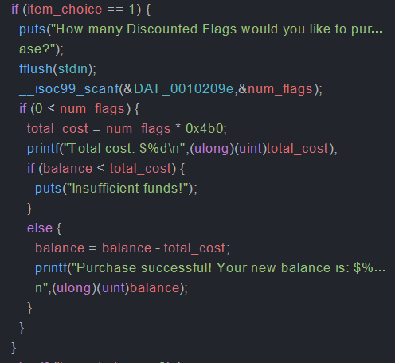
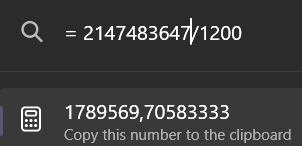
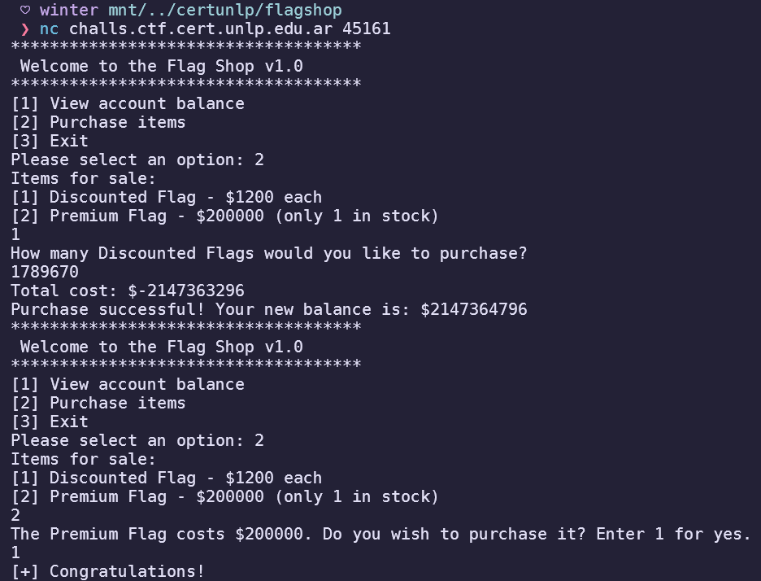
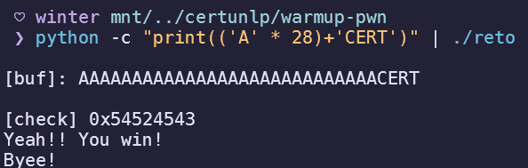
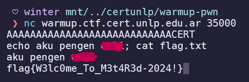
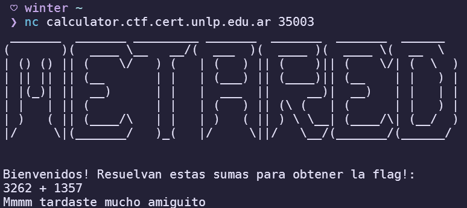
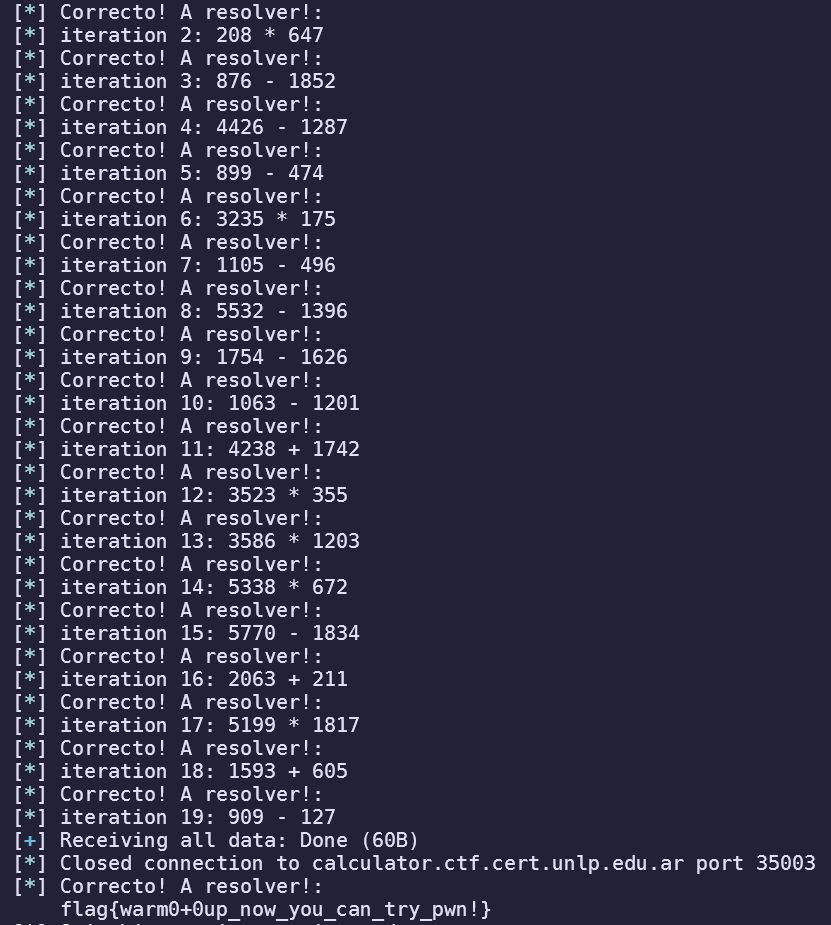

import PostFileDownload from "../../../components/PostFileDownload.astro";

## flagshop

<PostFileDownload name="2024-metared-flagshop.zip" />

Given a binary, it contained a simple flag shop program:


I decided to open Ghidra to analyze it further.



Looking at the decompiled binary, the vulnerability in this challenge is a simple integer overflow to make the total cost negative so I could add to the balance to buy the flag.



Using a simple calculation to divide a number above the **32-bit signed integer limit** with the cost of the discounted flag, I was able to do an integer overflow to buy the flag!



## Warmup

<PostFileDownload name="2024-metared-warmup.zip" />

I actually didn't get to solve this challenge for the points, so I played this challenge just for practice. Given source code that looks like this:

```c
// gcc -Wall -fno-stack-protector -z execstack -no-pie -o reto reto.c
#include <unistd.h>
#include <sys/types.h>
#include <stdlib.h>
#include <stdio.h>

int main()
{

  int var;
  int check = 0x12345678;
  char buf[20];

  fgets(buf,45,stdin);

  printf("\n[buf]: %s\n", buf);
  printf("[check] %p\n", check);

  if ((check != 0x12345678) && (check != 0x54524543))
    printf ("\nClooosse!\n");

  if (check == 0x54524543)
   {
     printf("Yeah!! You win!\n");
     setreuid(geteuid(), geteuid());
     system("/bin/bash");
     printf("Byee!\n");
   }
   return 0;
}
```

I was able to know that this is a simple buffer overflow challenge, because the `buf` variable stores only 20 chars yet the `fgets` function reads 45 characters at maximum. We can solve this without using a debugger because it prints out the variable check for the overflow. So I tested the output with a cyclic pattern to find the offset until the variable gets overwritten.

```
$ ./reto
aaaabaaacaaadaaaeaaafaaagaaahaaaiaaajaaakaaal

[buf]: aaaabaaacaaadaaaeaaafaaagaaahaaaiaaajaaakaaa
[check] 0x61616168

Clooosse!

$ cyclic -l 0x61616168
28
```

We also know that the winning check requires `check == 0x54524543` which is the same thing as inputting `CERT` to the variable. Using this knowledge, I built a payload using python:



Using this payload I was able to solve the challenge to obtain the flag using the obtained shell.



## Trust in my calculator

This is a calculator challenge on netcat, with randomized numbers. Even though this was a simple challenge, it really trained me to properly use **pwntools** to parse through bytes received from the remote. Also I was late to solving this challenge and another team member stole my points :angry:



Using the knowledge that the numbers always come after the `:` sign, this was my solver script that I brute forced the iteration range to be 20 questions :sob:

```python
from pwn import *

host = 'calculator.ctf.cert.unlp.edu.ar'
port = 35003

io = connect(host, port)
log.info(io.recvuntil(':'))

for i in range(20):
    log.info(io.recvuntil('\n'))
    num1 = int(io.recvuntil(' ', drop=True).decode())
    operation = io.recvuntil(' ', drop=True).decode()
    num2 = int(io.recvuntil('\n', drop=True).decode())
    log.info(f'iteration {i}: {num1} {operation} {num2}')

    if operation == '+':
        result = num1 + num2
    elif operation == '-':
        result = num1 - num2
    elif operation == '*':
        result = num1 * num2

    io.sendline(bytes(str(result), 'utf-8'))

log.info(io.recvall())

io.interactive()
```

Using the mentioned script, I was able to obtain the flag!


